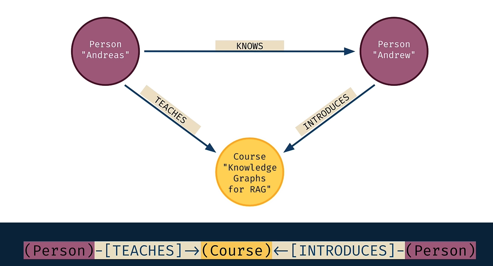
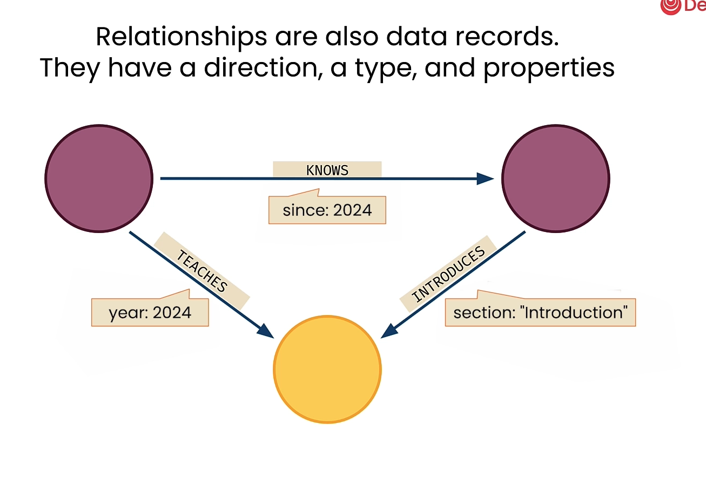
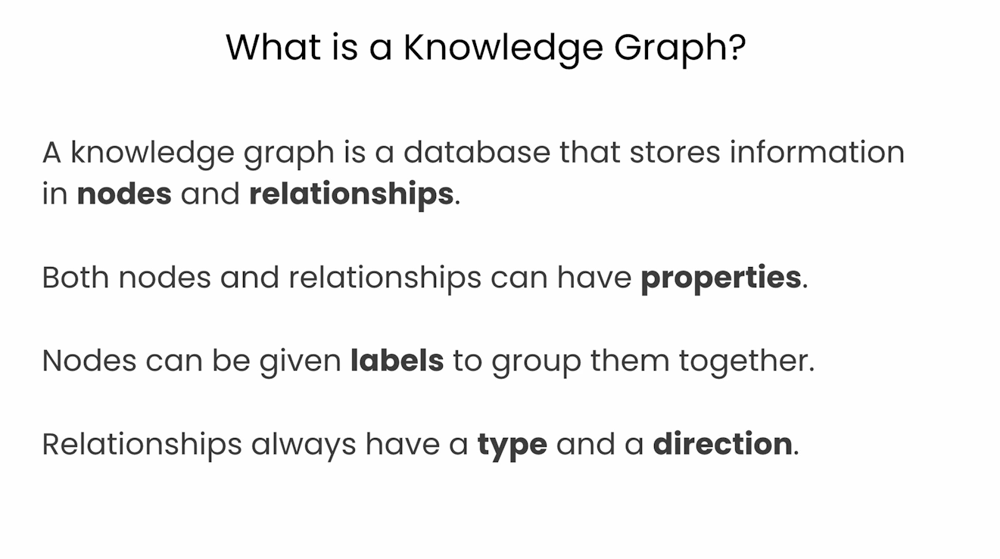

# Lesson 1: Knowledge Graph Fundamentals

> 학습 날짜: 2026-09-09
> 상태: ✅ 완료

## 이 레슨의 목표

- 지식 그래프의 기본 구성 요소(노드, 관계, 속성) 이해
- 그래프 데이터 모델이 관계형/문서형과 다른 점 파악

## 핵심 개념

### 노드 (Node)

- 엔티티를 표현. **라벨(Label)** 로 타입을 구분 (예: `:Person`, `:Movie`)
- 하나의 노드가 라벨을 여러 개 가질 수도 있음
- 속성(Property)을 key/value로 보유



### 관계 (Relationship)

관계는 세 가지를 가진다:

1. **방향(direction)** — 항상 시작 노드 → 끝 노드
2. **타입(type)** — 예: `ACTED_IN`, `DIRECTED`
3. **속성(properties)** — 관계에도 key/value를 붙일 수 있음

```cypher
(:Person)-[:ACTED_IN]->(:Movie)
```



### 속성 (Property)

- 노드와 관계 **모두** 속성을 가질 수 있다
- 스키마를 미리 정의하지 않아도 되고, 노드마다 속성 구성이 달라도 된다

### Knowledge Graph란?



- 데이터를 **노드 + 관계**로 표현해, 데이터 자체가 곧 구조(의미)를 담는 형태
- 관계형 DB는 조인 테이블을 통해 연결을 "계산"하지만, 그래프 DB는 연결이 데이터에 직접 저장되어 있음

## 배운 점 / 인사이트

- 라벨은 SQL의 테이블명, 속성은 컬럼, 관계는 조인 테이블에 대응시켜 생각하면 진입이 쉽다
- 다만 조인 테이블과 달리 **관계 자체가 1급 시민**이라 타입과 속성을 가진다는 점이 결정적 차이
- 관계에 방향이 있다는 점이 이후 Cypher 쿼리에서 계속 중요하게 작용한다

## 참고

- [Neo4j Cypher Manual](https://neo4j.com/docs/cypher-manual/current/)
