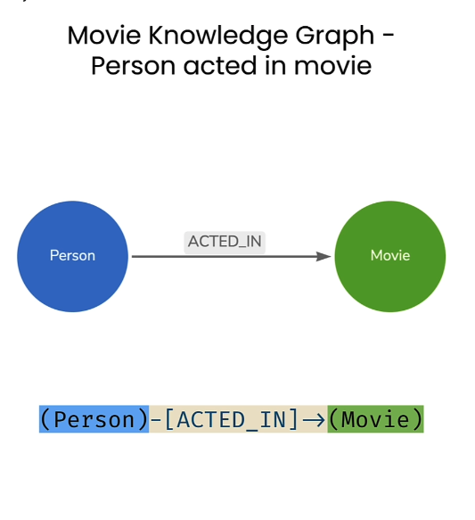
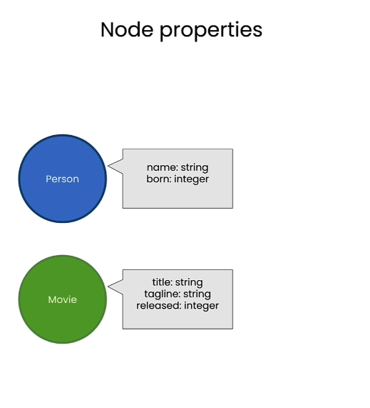
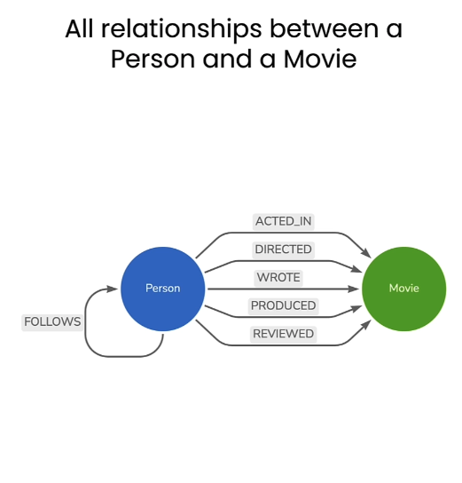

# Lesson 2: Querying Knowledge Graphs with Cypher

> 학습 날짜: 2026-09-09
> 상태: ✅ 완료
> 실습 노트북: [L2-query_with_cypher.ipynb](L2-query_with_cypher.ipynb)

## 이 레슨의 목표

- Cypher의 `MATCH` 패턴 문법으로 노드/관계를 조회한다
- LangChain의 `Neo4jGraph`로 파이썬에서 그래프에 질의한다
- `CREATE` / `MERGE` / `DELETE`로 그래프를 수정한다

## 실습 대상 그래프 (Movie DB)



`(Person)-[:ACTED_IN]->(Movie)` 가 기본 패턴.



| 라벨 | 속성 |
|---|---|
| `Person` | `name: string`, `born: integer` |
| `Movie` | `title: string`, `tagline: string`, `released: integer` |

> ⚠️ 개봉연도 속성명은 `releaseYear`가 아니라 **`released`** 다.



Person → Movie 관계는 `ACTED_IN`, `DIRECTED`, `WROTE`, `PRODUCED`, `REVIEWED` 가 있고,
Person → Person 으로 자기 자신을 향하는 `FOLLOWS` 관계도 존재한다.

## 셋업

```python
from dotenv import load_dotenv
import os
from langchain_community.graphs import Neo4jGraph

import warnings
warnings.filterwarnings("ignore")

load_dotenv('.env', override=True)
NEO4J_URI = os.getenv('NEO4J_URI')
NEO4J_USERNAME = os.getenv('NEO4J_USERNAME')
NEO4J_PASSWORD = os.getenv('NEO4J_PASSWORD')
NEO4J_DATABASE = os.getenv('NEO4J_DATABASE')

kg = Neo4jGraph(
    url=NEO4J_URI, username=NEO4J_USERNAME,
    password=NEO4J_PASSWORD, database=NEO4J_DATABASE
)
```

`kg.query(cypher)` 의 결과는 **dict의 리스트**로 돌아온다.

## 주요 쿼리

### 1. 카운트

```cypher
MATCH (n) RETURN count(n) AS numberOfNodes
MATCH (m:Movie) RETURN count(m) AS numberOfMovies
MATCH (people:Person) RETURN count(people) AS numberOfPeople
```

```python
print(f"There are {result[0]['numberOfNodes']} nodes in this graph.")
```

> 노트북에는 일부러 `(n:Moive)` 오타 셀이 들어있다. **에러가 아니라 0이 반환**된다 —
> 없는 라벨은 그냥 매칭 실패로 처리되므로 오타를 잡아주지 않는다.

### 2. 속성으로 노드 찾기

```cypher
MATCH (tom:Person {name:"Tom Hanks"}) RETURN tom
MATCH (cloudAtlas:Movie {title:"Cloud Atlas"}) RETURN cloudAtlas
MATCH (cloudAtlas:Movie {title:"Cloud Atlas"}) RETURN cloudAtlas.released, cloudAtlas.tagline
```

### 3. 조건 매칭 (WHERE)

```cypher
MATCH (nineties:Movie)
WHERE nineties.released >= 1990
  AND nineties.released < 2000
RETURN nineties.title, nineties.released
ORDER BY nineties.released DESC
LIMIT 5
```

- `ORDER BY`의 기본은 `ASC`, 내림차순은 `DESC`
- 다중 정렬: `ORDER BY nineties.released DESC, nineties.title ASC`
- 절 순서는 **`ORDER BY` → `SKIP` → `LIMIT`**
- `RETURN ... AS year` 별칭을 `ORDER BY year`로 쓸 수 있어 더 읽기 좋다
- `ORDER BY`는 `WITH` 뒤에도 올 수 있다 (중간 단계 정렬)

### 4. 관계 패턴 매칭

```cypher
MATCH (actor:Person)-[:ACTED_IN]->(movie:Movie)
RETURN actor.name, movie.title LIMIT 10

MATCH (tom:Person {name: "Tom Hanks"})-[:ACTED_IN]->(tomHanksMovies:Movie)
RETURN tom.name, tomHanksMovies.title
```

### 5. 공동 출연자 (핵심 패턴)

```cypher
MATCH (tom:Person {name:"Tom Hanks"})-[:ACTED_IN]->(m)<-[:ACTED_IN]-(coActors)
RETURN coActors.name, m.title
```

읽는 법:

```
(tom)  -[:ACTED_IN]->  (m)  <-[:ACTED_IN]-  (coActors)
톰       출연했다      영화 m    출연했다      다른 배우
```

- 두 번째 화살표가 **`<-` 로 뒤집힌 이유**: 관계 방향은 항상 `Person → Movie`이므로,
  영화에서 다른 배우로 가려면 관계를 역방향으로 타야 한다
- 가운데 `m`을 **같은 변수로 재사용**한 것이 곧 "같은 영화"라는 조인 조건이다

### 6. 삭제 — 관계만 지우기

```cypher
MATCH (emil:Person {name:"Emil Eifrem"})-[actedIn:ACTED_IN]->(movie:Movie)
DELETE actedIn
```

`actedIn`은 **관계** 변수(대괄호)이므로 노드는 남고 관계만 지워진다.
노드까지 지우려면 `DETACH DELETE`(연결된 관계를 함께 제거)를 쓴다.

### 7. 추가 — CREATE와 MERGE

```cypher
CREATE (andreas:Person {name:"Andreas"})
RETURN andreas
```

```cypher
MATCH (andreas:Person {name:"Andreas"}), (emil:Person {name:"Emil Eifrem"})
MERGE (andreas)-[hasRelationship:WORKS_WITH]->(emil)
RETURN andreas, hasRelationship, emil
```

- 1행의 **콤마**는 "이것도 찾아라" — 서로 연결되지 않은 두 노드를 각각 바인딩.
  관계를 만들려면 양쪽 끝 노드를 먼저 손에 쥐어야 한다
- 2행의 `(andreas)`, `(emil)`은 라벨/속성 없이 **변수명만** 재사용 (새로 찾는 게 아님)
- `CREATE`는 무조건 새로 만들어 재실행하면 중복 생성,
  `MERGE`는 **있으면 찾고 없으면 만든다**(멱등) → 재실행에 안전
- `MERGE`는 패턴 **전체**(방향 포함)를 하나로 본다. 방향이 반대면 다른 패턴으로 취급

실행 결과:

```python
[{'andreas': {'name': 'Andreas'},
  'hasRelationship': ({'name': 'Andreas'}, 'WORKS_WITH',
                      {'born': 1978, 'name': 'Emil Eifrem'}),
  'emil': {'born': 1978, 'name': 'Emil Eifrem'}}]
```

`hasRelationship`은 `(시작노드, 관계타입, 끝노드)` 3튜플로 반환된다.

## 배운 점 / 인사이트

### coActors를 SQL로 옮기면 셀프 조인

```sql
SELECT co.name, m.title
FROM person AS tom
JOIN acted_in AS a1 ON a1.person_id = tom.id      -- (tom)-[:ACTED_IN]->
JOIN movie    AS m  ON m.id = a1.movie_id         --                    (m)
JOIN acted_in AS a2 ON a2.movie_id = m.id         --                    (m)<-[:ACTED_IN]-
JOIN person   AS co ON co.id = a2.person_id       --                              (coActors)
WHERE tom.name = 'Tom Hanks';
```

| Cypher | SQL |
|---|---|
| `(tom:Person)` | `person AS tom` |
| `{name:"Tom Hanks"}` | `WHERE tom.name = 'Tom Hanks'` |
| `-[:ACTED_IN]->` | `JOIN acted_in AS a1` |
| `(m)` | `movie AS m` |
| `<-[:ACTED_IN]-` | `JOIN acted_in AS a2 ON a2.movie_id = m.id` |
| `(coActors)` | `person AS co` |

즉 `coActors`는 **`person AS co`, 두 번째로 등장한 person 테이블 별칭**이다.
SQL이라면 조인 테이블을 두 번 셀프 조인해야 할 것을 Cypher는 화살표 한 줄로 표현한다.

### 관계 유일성 (relationship uniqueness) — 오늘 가장 헷갈렸던 부분

Cypher는 **하나의 `MATCH` 패턴 안에서 같은 관계를 두 번 사용하지 않는다.**

```
(tom)-[:ACTED_IN]->(m)<-[:ACTED_IN]-(coActors)
      ↑ 관계 1              ↑ 관계 2
```

`coActors`가 톰 자신이 되려면 관계 2가 관계 1과 똑같은 관계여야 하는데,
이게 금지되므로 **톰 행크스는 자동으로 결과에서 빠진다.**
→ 이 쿼리에서는 `WHERE coActors <> tom`이 필요 없다.

실제 결과에서 *Cast Away* 행에 `Helen Hunt` 하나만 나오는 것이 그 증거
(출연자가 톰과 헬렌 둘뿐인데 톰이 제외됨).

반면 위 SQL에는 이 규칙이 없어서 `AND co.id <> tom.id`가 **진짜로 필요하다.**
SQL 직관을 그대로 가져오면 틀리는 지점.

이 규칙은 **관계에만** 적용되고 노드에는 적용되지 않는다.
그래서 다른 타입의 관계로 같은 노드에 돌아오는 건 가능:

```cypher
MATCH (tom:Person {name:"Tom Hanks"})-[:ACTED_IN]->(m)<-[:DIRECTED]-(tom)
RETURN m.title
```

### 변수는 노드가 아니라 "노드를 가리키는 이름"

- `(coActors)` 소괄호 → **노드** 변수
- `[actedIn:ACTED_IN]` 대괄호 → **관계** 변수
- 이름이 복수형이어도 리스트가 아니다. 매칭이 10건이면 **10행**이 되고 각 행에 노드 하나씩.
  진짜 리스트로 묶으려면 집계 함수:

```cypher
MATCH (tom:Person {name:"Tom Hanks"})-[:ACTED_IN]->(m)<-[:ACTED_IN]-(coActors)
RETURN m.title, collect(coActors.name) AS cast
```

노드 변수로 할 수 있는 것: `RETURN coActors`(dict 전체), `coActors.name`,
`labels(coActors)`, `id(coActors)`, `WHERE coActors <> tom`(내부 id 기준 비교라 동명이인에 안전)

## 헷갈렸던 점 / 질문

### Q. 주피터에서 주석은 어떻게 다나?

- **파이썬 코드 부분** → `#`
- **`"""..."""` 안의 Cypher 문자열** → `//` (한 줄), `/* ... */` (여러 줄).
  이 안쪽은 파이썬이 아니라 Neo4j로 전송되는 문자열이라 `#`을 쓰면 안 된다
- 설명이 길면 셀을 마크다운으로 전환 (`Esc` → `M`, 되돌리기는 `Esc` → `Y`)

### Q. MERGE를 실행했는데 조회하면 빈 결과가 나온다

```python
MATCH (a:Person {name:"Andreas"})-[:WORKS_WITH]->(x) RETURN x.name
# → []
```

**원인: `MATCH`가 아무것도 못 찾으면 행이 0개가 되고, 뒤의 `MERGE`는
실행할 행이 없어 에러 없이 조용히 건너뛴다.** `[]`만 반환되어 실패한 티가 안 난다.

이번 경우는 `CREATE (andreas...)` 셀을 실행하기 전에 `MERGE` 셀을 돌린 셀 실행 순서 문제였다.
주피터에서 셀을 위아래로 오가며 실행할 때 자주 발생 →
왼쪽 `In [n]` 번호로 실제 실행 순서를 확인하고, 헷갈리면 **Kernel → Restart & Run All**.

진단용 쿼리:

```cypher
// 노드가 실제로 있는지
MATCH (p:Person) WHERE p.name IN ["Andreas", "Emil Eifrem"] RETURN p.name

// 이름 철자 확인
MATCH (p:Person) WHERE p.name STARTS WITH "Emil" RETURN p.name

// 특정 노드의 모든 관계 (방향 무시)
MATCH (a:Person {name:"Andreas"})-[r]-(other) RETURN type(r), other.name
```

### Q. 관계 방향은 조회에 어떤 영향을 주나?

```cypher
MATCH (a:Person {name:"Andreas"})-[:WORKS_WITH]->(x) RETURN x.name   // 나옴
MATCH (e:Person {name:"Emil Eifrem"})-[:WORKS_WITH]->(x) RETURN x.name // 안 나옴 (방향 반대)
MATCH (e:Person {name:"Emil Eifrem"})-[:WORKS_WITH]-(x) RETURN x.name  // 나옴 (화살표 없음 = 방향 무시)
```

"함께 일한다"처럼 원래 상호적인 관계는 양쪽에 관계를 두 개 만들기보다,
**한 방향으로 저장하고 조회할 때 화살표를 빼는** 것이 일반적인 패턴이다.

## 참고

- 강의: [Querying Knowledge Graphs](https://learn.deeplearning.ai/courses/knowledge-graphs-rag/lesson/whiue/querying-knowledge-graphs)
- [Cypher: Uniqueness of relationships](https://neo4j.com/docs/cypher-manual/current/patterns/reference/#pattern-relationship-uniqueness)
