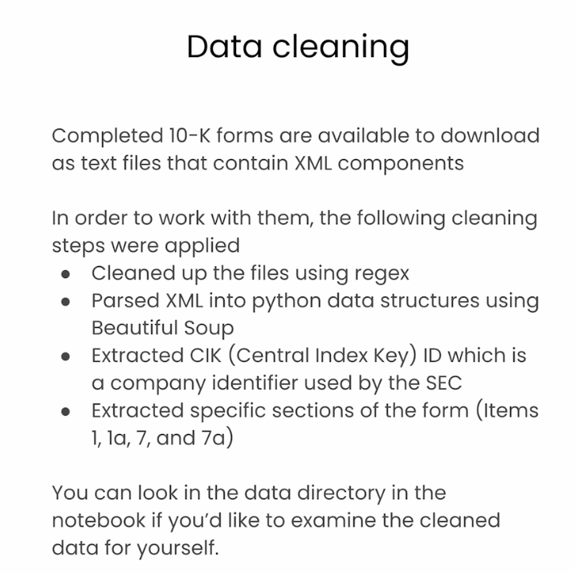

# Lesson 4: Constructing a Knowledge Graph from Text Documents

> 학습 날짜: 2026-09-20
> 상태: ✅ 완료
> 실습 노트북: [L4-construct_kg_from_text.ipynb](L4-construct_kg_from_text.ipynb)

## 이 레슨의 목표

- 원본 텍스트 문서를 **청크로 쪼개** 그래프 노드(`:Chunk`)로 만든다
- 청크에 **메타데이터**를 붙여 노드 속성으로 저장한다
- 벡터 인덱스를 만들고 임베딩을 채운 뒤, LangChain으로 **RAG 질의응답**까지 연결한다

> L3는 이미 존재하는 `Movie` 노드에 임베딩을 붙였다면,
> L4는 **텍스트로부터 그래프 자체를 만들어낸다.**

## 전체 흐름

```
JSON 파일 → 텍스트 분할(청크) → 메타데이터 부착 → :Chunk 노드 생성(MERGE)
         → 유니크 제약 → 벡터 인덱스 → 임베딩 저장 → 유사도 검색 → LangChain RAG
```

---

## 데이터 준비 (Data cleaning)



원본 데이터는 **SEC의 10-K 공시 서류**다.
완성된 10-K는 **XML 요소가 섞인 텍스트 파일**로 다운로드되는데, 그대로는 다루기 어려워
다음 전처리를 거친 상태로 제공된다.

| 단계 | 내용 |
|---|---|
| 1. 정제 | **regex**로 파일을 정리 |
| 2. 파싱 | **Beautiful Soup**으로 XML을 파이썬 자료구조로 변환 |
| 3. 식별자 추출 | **CIK**(Central Index Key) 추출 — SEC가 쓰는 **회사 식별자** |
| 4. 본문 추출 | 서류의 특정 섹션만 추출 — **Item 1, 1a, 7, 7a** |

> 이 전처리는 강의 측에서 미리 해둔 것이고, 결과물은 노트북의 `data` 디렉터리에서 직접 열어볼 수 있다.

### 메모

- **10-K**: 미국 상장사가 SEC에 제출하는 연차 보고서. [EDGAR](https://www.sec.gov/edgar/search/)에서 검색 가능
- 이번 실습 대상은 **NetApp** 한 회사의 10-K 하나
- **CIK**: 회사마다 부여되는 고유 번호 → 그래프에서 **회사 노드의 키**로 쓰기 좋다
- 추출한 섹션의 의미
  - **Item 1** — 사업 개요 (Business)
  - **Item 1a** — 위험 요소 (Risk Factors)
  - **Item 7** — 경영진 논의 및 분석 (MD&A)
  - **Item 7a** — 시장 위험 관련 공시
- 서류 전체가 아니라 **서술형 본문 위주의 섹션만** 고른 것이 포인트

---

## 셋업

```python
from dotenv import load_dotenv
import os
import json
import textwrap

from langchain_community.graphs import Neo4jGraph
from langchain_community.vectorstores import Neo4jVector
from langchain_openai import OpenAIEmbeddings, ChatOpenAI
from langchain.text_splitter import RecursiveCharacterTextSplitter
from langchain.chains import RetrievalQAWithSourcesChain

import warnings
warnings.filterwarnings("ignore")

load_dotenv('.env', override=True)
NEO4J_URI = os.getenv('NEO4J_URI')
NEO4J_USERNAME = os.getenv('NEO4J_USERNAME')
NEO4J_PASSWORD = os.getenv('NEO4J_PASSWORD')
NEO4J_DATABASE = os.getenv('NEO4J_DATABASE') or 'neo4j'
OPENAI_API_KEY = os.getenv('OPENAI_API_KEY')
OPENAI_ENDPOINT = os.getenv('OPENAI_BASE_URL') + '/embeddings'  # 강의 환경 전용

# 전역 상수 - 인덱스/노드/속성 이름을 한 곳에서 관리
VECTOR_INDEX_NAME = 'form_10k_chunks'
VECTOR_NODE_LABEL = 'Chunk'
VECTOR_SOURCE_PROPERTY = 'text'
VECTOR_EMBEDDING_PROPERTY = 'textEmbedding'
```

> 상수를 따로 뺀 이유: 인덱스 이름과 속성명이 **Cypher 쿼리와 LangChain 설정 양쪽에**
> 등장하기 때문. 한 군데만 바꿔도 되도록 묶어둔 것이다.

## 1. 원본 JSON 확인

```python
first_file_name = "./data/form10k/0000950170-23-027948.json"
first_file_as_object = json.load(open(first_file_name))

for k, v in first_file_as_object.items():
    print(k, type(v))

item1_text = first_file_as_object['item1']
item1_text[0:1500]
```

JSON의 키: `item1`, `item1a`, `item7`, `item7a`(본문 텍스트) + `names`, `cik`, `cusip6`, `source`(메타데이터).
파일명 `0000950170-23-027948`은 SEC의 **accession number**로, 나중에 `formId`가 된다.

## 2. 텍스트를 청크로 분할

```python
text_splitter = RecursiveCharacterTextSplitter(
    chunk_size = 2000,
    chunk_overlap  = 200,
    length_function = len,
    is_separator_regex = False,
)

item1_text_chunks = text_splitter.split_text(item1_text)
len(item1_text_chunks)
```

| 파라미터 | 의미 |
|---|---|
| `chunk_size=2000` | 청크 하나의 목표 길이(문자 수) |
| `chunk_overlap=200` | **앞 청크의 끝 200자를 다음 청크가 겹쳐 가진다** |
| `length_function=len` | 길이를 문자 수로 계산 (토큰 수가 아님) |
| `is_separator_regex=False` | 구분자를 정규식이 아닌 일반 문자열로 취급 |

**왜 `chunk_overlap`이 필요한가**: 문장이 청크 경계에서 잘리면 양쪽 모두 맥락이 깨진다.
겹치게 두면 경계에 걸친 내용이 최소한 한쪽 청크에는 온전히 들어간다.

**`Recursive`의 의미**: 구분자를 우선순위대로 재귀적으로 시도해
**의미 단위를 최대한 지키면서** 자른다 → 아래 [헷갈렸던 점](#q-recursivecharactertextsplitter의-recursive가-무슨-뜻인가) 참고.

## 3. 청크에 메타데이터 붙이기

```python
def split_form10k_data_from_file(file):
    chunks_with_metadata = []                     # 청크 레코드를 모을 리스트
    file_as_object = json.load(open(file))

    for item in ['item1', 'item1a', 'item7', 'item7a']:
        print(f'Processing {item} from {file}')
        item_text = file_as_object[item]
        item_text_chunks = text_splitter.split_text(item_text)

        chunk_seq_id = 0
        for chunk in item_text_chunks[:20]:       # 속도를 위해 섹션당 20개로 제한
            form_id = file[file.rindex('/') + 1:file.rindex('.')]   # 파일명에서 추출
            chunks_with_metadata.append({
                'text': chunk,
                # 루프에서 나온 메타데이터
                'f10kItem': item,
                'chunkSeqId': chunk_seq_id,
                # 조합해서 만든 메타데이터
                'formId': f'{form_id}',
                'chunkId': f'{form_id}-{item}-chunk{chunk_seq_id:04d}',
                # 파일에 들어있던 메타데이터
                'names': file_as_object['names'],
                'cik': file_as_object['cik'],
                'cusip6': file_as_object['cusip6'],
                'source': file_as_object['source'],
            })
            chunk_seq_id += 1
        print(f'\tSplit into {chunk_seq_id} chunks')
    return chunks_with_metadata

first_file_chunks = split_form10k_data_from_file(first_file_name)
```

**이 함수가 이 레슨의 핵심이다.** 단순한 텍스트 조각을 *그래프에 넣을 수 있는 레코드*로 바꾼다.

가장 중요한 필드는 `chunkId`:

```
0000950170-23-027948-item1-chunk0000
└─── formId ───────┘ └item┘ └ 순번 ┘
```

- `{:04d}`로 0 채움(`chunk0000`) → 문자열 정렬해도 순서가 유지된다
- 이 값이 **노드의 고유 키**가 되어 `MERGE`와 유니크 제약의 기준이 된다
- `chunkSeqId`는 섹션 내 순서 → **L6에서 `NEXT` 관계로 청크를 잇는 데 쓰인다**

> `item_text_chunks[:20]`은 실습 속도를 위한 제한이다. 실제라면 전부 처리한다.

## 4. `:Chunk` 노드 생성

```python
merge_chunk_node_query = """
MERGE(mergedChunk:Chunk {chunkId: $chunkParam.chunkId})
    ON CREATE SET
        mergedChunk.names = $chunkParam.names,
        mergedChunk.formId = $chunkParam.formId,
        mergedChunk.cik = $chunkParam.cik,
        mergedChunk.cusip6 = $chunkParam.cusip6,
        mergedChunk.source = $chunkParam.source,
        mergedChunk.f10kItem = $chunkParam.f10kItem,
        mergedChunk.chunkSeqId = $chunkParam.chunkSeqId,
        mergedChunk.text = $chunkParam.text
RETURN mergedChunk
"""

kg = Neo4jGraph(url=NEO4J_URI, username=NEO4J_USERNAME,
                password=NEO4J_PASSWORD, database=NEO4J_DATABASE)

kg.query(merge_chunk_node_query, params={'chunkParam': first_file_chunks[0]})
```

- `MERGE(... {chunkId: ...})` — **`chunkId`만으로** 노드를 식별한다.
  같은 id면 기존 노드를 찾고, 없으면 새로 만든다 (L2에서 본 멱등성)
- `ON CREATE SET` — **새로 만들어질 때만** 속성을 채운다.
  이미 있는 노드는 건드리지 않으므로 재실행해도 기존 데이터가 덮어써지지 않는다
  (항상 갱신하려면 `ON MATCH SET`을 쓴다)
- `$chunkParam.chunkId` — 파이썬 dict를 통째로 파라미터로 넘기고 점 표기로 꺼내 쓴다.
  필드마다 파라미터를 만들 필요가 없다

### 유니크 제약 조건

```cypher
CREATE CONSTRAINT unique_chunk IF NOT EXISTS
    FOR (c:Chunk) REQUIRE c.chunkId IS UNIQUE
```

중복 청크를 DB 차원에서 막는다. 제약을 걸면 인덱스도 함께 생겨 `MERGE` 조회도 빨라진다.
`SHOW INDEXES`로 확인.

### 전체 청크 노드 생성

```python
node_count = 0
for chunk in first_file_chunks:
    print(f"Creating `:Chunk` node for chunk ID {chunk['chunkId']}")
    kg.query(merge_chunk_node_query, params={'chunkParam': chunk})
    node_count += 1
print(f"Created {node_count} nodes")
```

```cypher
MATCH (n) RETURN count(n) as nodeCount
```

**23개 노드**가 생긴다. 섹션당 최대 20개 제한이 걸려 있으므로,
item1이 20개(잘림) + 나머지 섹션들이 20개 미만이라 합이 23.

## 5. 벡터 인덱스 + 임베딩 (L3와 동일한 패턴)

```cypher
CREATE VECTOR INDEX `form_10k_chunks` IF NOT EXISTS
  FOR (c:Chunk) ON (c.textEmbedding)
  OPTIONS { indexConfig: {
    `vector.dimensions`: 1536,
    `vector.similarity_function`: 'cosine'
 }}
```

```cypher
MATCH (chunk:Chunk) WHERE chunk.textEmbedding IS NULL
WITH chunk, genai.vector.encode(
  chunk.text, "OpenAI",
  {token: $openAiApiKey, endpoint: $openAiEndpoint}) AS vector
CALL db.create.setNodeVectorProperty(chunk, "textEmbedding", vector)
```

L3의 `Movie.tagline` → `Movie.taglineEmbedding`이
여기서는 `Chunk.text` → `Chunk.textEmbedding`으로 바뀐 것뿐, 구조는 같다.

- `WHERE chunk.textEmbedding IS NULL` — **아직 임베딩이 없는 것만** 처리.
  재실행 시 이미 끝난 청크를 다시 호출하지 않아 비용과 시간을 아낀다

```python
kg.refresh_schema()
print(kg.schema)
```

LangChain이 캐싱한 스키마를 갱신해서, 새로 생긴 `Chunk` 라벨과 속성들을 확인한다.

## 6. 유사도 검색

```python
def neo4j_vector_search(question):
  """Search for similar nodes using the Neo4j vector index"""
  vector_search_query = """
    WITH genai.vector.encode(
      $question, "OpenAI",
      {token: $openAiApiKey, endpoint: $openAiEndpoint}) AS question_embedding
    CALL db.index.vector.queryNodes($index_name, $top_k, question_embedding) yield node, score
    RETURN score, node.text AS text
  """
  similar = kg.query(vector_search_query,
                     params={'question': question,
                             'openAiApiKey': OPENAI_API_KEY,
                             'openAiEndpoint': OPENAI_ENDPOINT,
                             'index_name': VECTOR_INDEX_NAME,
                             'top_k': 10})
  return similar

search_results = neo4j_vector_search('In a single sentence, tell me about Netapp.')
search_results[0]
```

L3와 같은 구조지만 **인덱스 이름까지 `$index_name` 파라미터로** 받는다 → 재사용 가능한 함수가 됨.

## 7. LangChain RAG 체인 연결

여기부터가 L4에서 새로 나온 부분. 검색 결과를 **LLM에게 넘겨 답변을 생성**한다.

```python
neo4j_vector_store = Neo4jVector.from_existing_graph(
    embedding=OpenAIEmbeddings(),
    url=NEO4J_URI,
    username=NEO4J_USERNAME,
    password=NEO4J_PASSWORD,
    index_name=VECTOR_INDEX_NAME,
    node_label=VECTOR_NODE_LABEL,                    # 'Chunk'
    text_node_properties=[VECTOR_SOURCE_PROPERTY],   # ['text']
    embedding_node_property=VECTOR_EMBEDDING_PROPERTY,  # 'textEmbedding'
)

retriever = neo4j_vector_store.as_retriever()

chain = RetrievalQAWithSourcesChain.from_chain_type(
    ChatOpenAI(temperature=0),
    chain_type="stuff",
    retriever=retriever
)

def prettychain(question: str) -> str:
    """Pretty print the chain's response to a question"""
    response = chain({"question": question}, return_only_outputs=True)
    print(textwrap.fill(response['answer'], 60))
```

- `from_existing_graph` — **이미 만들어 둔** 그래프와 인덱스에 연결한다(새로 만들지 않음).
  앞에서 정의한 전역 상수들이 여기서 쓰인다
- `retriever` — "질문을 주면 관련 청크를 가져오는 객체". 6번 함수를 LangChain이 대신 해주는 것
- `chain_type="stuff"` — 검색된 청크를 **전부 프롬프트에 밀어넣는(stuff)** 방식.
  가장 단순하며, 청크가 많으면 컨텍스트 한계에 걸린다
- `temperature=0` — 매번 같은 답이 나오도록. 사실 기반 QA에 적합
- `RetrievalQAWithSourcesChain` — 답변과 함께 **출처(source)** 를 돌려주는 체인.
  청크에 `source` 속성을 넣어둔 것이 여기서 쓰인다

### 질문해보기

```python
prettychain("What is Netapp's primary business?")
prettychain("where is Netapp?")
prettychain("""
    Tell me about Netapp.
    Limit your answer to a single sentence.
""")
```

### 환각(hallucination) 실험 — 이 레슨의 백미

```python
prettychain("""
    Tell me about Apple.
    Limit your answer to a single sentence.
""")
```

그래프에는 **NetApp 문서밖에 없는데도** Apple에 대해 그럴듯한 답이 나온다.
검색된 청크에 답이 없으면 LLM이 **자기 사전 지식으로 채워버리기** 때문.

```python
prettychain("""
    Tell me about Apple.
    Limit your answer to a single sentence.
    If you are unsure about the answer, say you don't know.
""")
```

한 줄을 추가하자 모른다고 답한다.
**프롬프트에 "모르면 모른다고 해라"를 명시하는 것만으로 환각이 크게 줄어든다.**

## 배운 점 / 인사이트

- **텍스트 → 그래프**의 실제 절차를 처음부터 끝까지 봤다.
  핵심은 청크를 그냥 저장하는 게 아니라 **식별자와 메타데이터를 설계해서 넣는 것**
- `chunkId`를 `formId + item + 순번`으로 조합한 게 결정적이다.
  이 하나로 (1) `MERGE` 기준 키, (2) 유니크 제약, (3) 재실행 안전성이 모두 확보된다
- `MERGE` + `ON CREATE SET` + `IF NOT EXISTS` + `WHERE ... IS NULL` —
  **모든 셀이 재실행에 안전하게** 설계되어 있다. 노트북 실습에서 특히 중요한 패턴
- 아직은 `Chunk` 노드들이 **서로 연결되지 않은 상태**다. 관계가 없으니 지금은 사실상
  벡터 DB와 다를 바 없다. → 다음 레슨(L5)에서 관계를 붙이면서 비로소 "그래프" RAG가 된다
- RAG 품질은 검색뿐 아니라 **프롬프트 설계**에도 달려 있다 (Apple 실험)

## 헷갈렸던 점 / 질문

### Q. `RecursiveCharacterTextSplitter`의 "Recursive"가 무슨 뜻인가?

**재귀(再歸)** 다. 회귀(regression)와는 전혀 다른 말이니 주의.

| 영어 | 한국어 | 뜻 |
|---|---|---|
| **recursive** | **재귀** | 같은 방법을 자기 자신에게 다시 적용 |
| regression | 회귀 | 통계·ML의 회귀분석 (선형회귀 등) |

기본 구분자 목록은 우선순위 순이다:

```python
["\n\n", "\n", " ", ""]
#  문단     줄    공백  문자
```

**동작 방식** — 큰 단위부터 시도하고, 아직 크면 더 잘게 쪼개 들어간다:

```
split(텍스트, ["\n\n", "\n", " ", ""])
  → 문단으로 자름
  → 조각이 아직 chunk_size보다 크네? → split(그 조각, ["\n", " ", ""])   ← 자기 자신을 다시 적용
        → 줄로 자름
        → 아직 크네? → split(그 조각, [" ", ""])                        ← 또 다시
```

이 **자기 반복 구조** 때문에 Recursive라는 이름이 붙었다.
(폴더 안의 폴더를 계속 들어가는 `ls -R`의 R도 같은 recursive다)

**왜 이렇게 하나 — 의미 단위를 지키려고.**
그냥 2000자마다 기계적으로 끊으면 단어 중간이 잘린다:

```
청크 1: "...NetApp provides cloud data serv"
청크 2: "ices and data management solutions..."
```

재귀적으로 자르면 문단/문장 경계에서 깔끔하게 끊긴다.
핵심은 **"가능하면 큰 의미 단위를 유지하고, 어쩔 수 없을 때만 더 잘게 쪼갠다"**.
청크 하나가 곧 검색 단위이자 LLM에 넘어가는 맥락이므로,
문장이 잘리면 임베딩도 부정확해지고 LLM도 제대로 읽지 못한다.

> `chunk_size=2000`은 엄격한 상한이 아니라 **목표치**다.
> 문단 경계를 지키려다 1700자에서 끊기기도 하고,
> 구분자가 전혀 없는 긴 텍스트라면 2000자를 넘길 수도 있다.

### Q. `chunk_overlap`이 있으면 같은 내용이 중복 저장되는 것 아닌가?

맞다. 의도된 중복이다. 경계에서 잘린 문장 때문에 검색이 실패하는 것보다,
200자를 겹쳐 저장하는 비용이 훨씬 싸다.

### Q. `ON CREATE SET`과 그냥 `SET`의 차이는?

- `ON CREATE SET` — 노드가 **새로 생성될 때만** 실행
- `ON MATCH SET` — **기존 노드를 찾았을 때만** 실행
- 그냥 `SET` — 둘 다일 때 실행

여기서 `ON CREATE SET`을 쓴 덕분에 셀을 다시 돌려도 기존 청크가 덮어써지지 않는다.

### Q. 노드가 왜 정확히 23개인가?

`item_text_chunks[:20]` 때문에 섹션당 최대 20개. item1만 20개로 잘렸고
나머지 세 섹션은 원래 20개 미만이라 합쳐서 23개가 된다.
(제한을 풀면 훨씬 많아진다)

### Q. 6번의 직접 만든 검색 함수와 7번의 LangChain retriever는 뭐가 다른가?

하는 일은 같다 — 질문을 임베딩해 유사한 청크를 찾는 것.
차이는 6번은 결과를 **그대로 돌려주고**, 7번은 그 결과를 **LLM에 넘겨 답변을 만든다**는 점.
즉 6번은 RAG의 R(Retrieval)까지, 7번은 G(Generation)까지다.

## 다음 레슨과의 연결

지금 `Chunk` 노드들은 고립되어 있다.
L5에서는 `Form`, `Company` 같은 노드를 추가하고 `NEXT`, `PART_OF` 같은 **관계를 연결**해서,
벡터 검색으로 찾은 청크에서 **그래프를 타고 확장**하는 진짜 Graph RAG로 넘어간다.
(`chunkSeqId`를 저장해 둔 것이 그때 쓰인다)

## 참고

- 강의: [Constructing a Knowledge Graph from Text Documents](https://learn.deeplearning.ai/courses/knowledge-graphs-rag)
- [SEC EDGAR](https://www.sec.gov/edgar/search/) / [10-K란](https://www.sec.gov/answers/form10k.htm)
- [RecursiveCharacterTextSplitter](https://python.langchain.com/docs/how_to/recursive_text_splitter/)
- [RetrievalQAWithSourcesChain](https://api.python.langchain.com/en/latest/chains/langchain.chains.qa_with_sources.retrieval.RetrievalQAWithSourcesChain.html)
