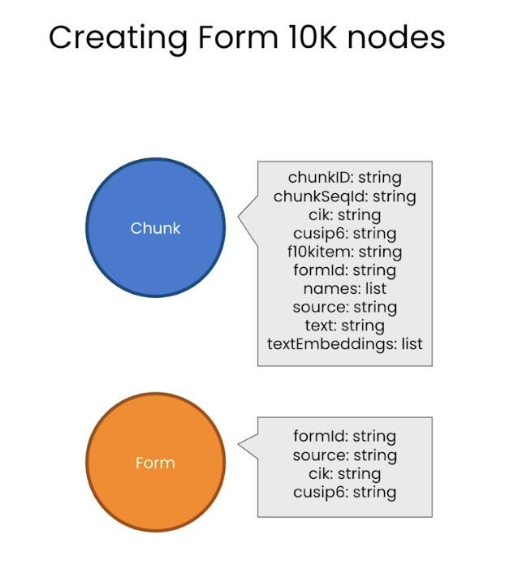
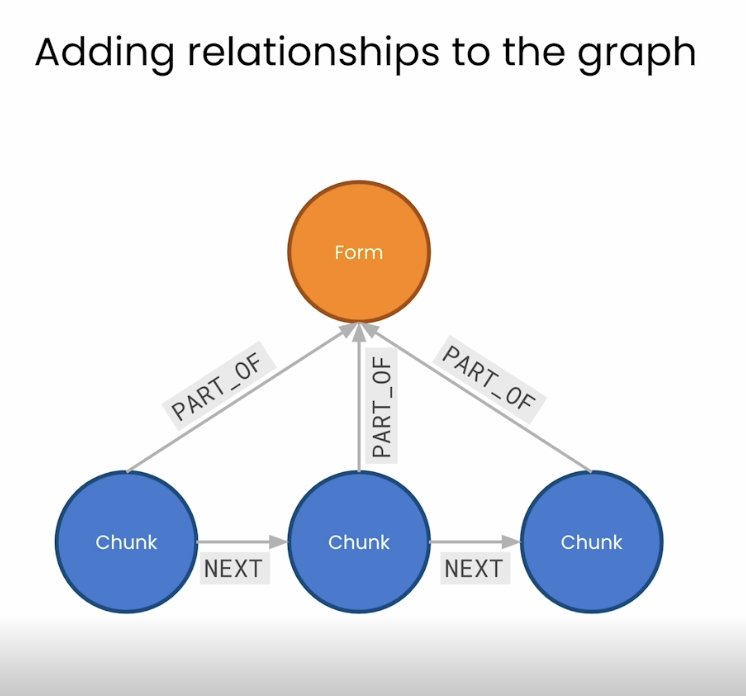

# Lesson 5: Adding Relationships to the SEC Knowledge Graph

> 학습 날짜: 2026-09-20
> 상태: ✅ 완료
> 실습 노트북: [L5-add_relationships_to_kg.ipynb](L5-add_relationships_to_kg.ipynb)

## 이 레슨의 목표

- 고립되어 있던 `:Chunk` 노드들을 **관계로 연결**한다
- `Form` 노드를 추가해 문서 구조를 그래프로 표현한다
- 벡터 검색으로 찾은 청크에서 **그래프를 타고 맥락을 확장**하는 검색으로 넘어간다

> L4까지는 `Chunk` 노드가 서로 연결되지 않아 사실상 벡터 DB와 다를 게 없었다.
> 관계가 붙는 이 지점부터 비로소 **Graph RAG**가 된다.

## 전체 흐름

```
Form 노드 생성 → 섹션별 청크 정렬 → NEXT 연결(apoc.nodes.link)
              → PART_OF 연결 → SECTION 연결
              → 경로(path) 쿼리 → retrieval_query로 윈도우 확장 RAG
```

## L4에서 이어지는 지점

L4에서 각 청크에 저장해 둔 메타데이터가 여기서 관계의 근거로 쓰인다:

| 속성 | L5에서의 쓰임 |
|---|---|
| `chunkSeqId` | 같은 섹션 내 청크 순서 → `NEXT` 관계 |
| `formId` | 같은 10-K 문서에 속함 → `PART_OF` 관계 |
| `f10kItem` | 섹션 구분 (item1/1a/7/7a) → `SECTION` 관계 |
| `cik` | 회사 식별자 |
| `cusip6` | 증권 식별자 |

---

## 핵심 개념

### Form 10-K 노드 만들기



기존 `Chunk` 노드 옆에 **`Form` 노드를 새로 만든다.** 각자의 속성은:

| `Chunk` (기존) | `Form` (신규) |
|---|---|
| `chunkId: string` | |
| `chunkSeqId: string` | |
| `cik: string` | `cik: string` |
| `cusip6: string` | `cusip6: string` |
| `f10kItem: string` | |
| `formId: string` | `formId: string` |
| `names: list` | |
| `source: string` | `source: string` |
| `text: string` | |
| `textEmbeddings: list` | |

**두 노드의 성격 차이:**

- `Chunk` — 문서의 **조각 하나**. 본문(`text`)과 임베딩을 들고 있어 **검색의 단위**가 된다
- `Form` — 10-K **문서 한 건 전체**를 대표. 본문도 임베딩도 없고 **식별 정보만** 가진다

**겹치는 속성이 곧 연결 고리다.** `formId`, `source`, `cik`, `cusip6` 네 개가 양쪽에 다 있는데,
이는 L4에서 청크를 만들 때 문서 단위 메타데이터를 각 청크에 **복사해 넣었기** 때문이다.
그중 `formId`가 "이 청크가 어느 문서에서 나왔는가"를 말해주므로,
이 값을 기준으로 `Chunk`와 `Form`을 관계로 이을 수 있다.

> 문서 수준 정보를 청크마다 중복 저장하던 것을, `Form` 노드로 **한 번만** 두고
> 관계로 참조하는 구조로 바꾸는 것. 정규화와 비슷한 발상이다.

### 그래프에 관계 추가하기



관계는 **두 종류**다.

| 관계 | 방향 | 의미 |
|---|---|---|
| `PART_OF` | `(Chunk)-[:PART_OF]->(Form)` | 이 청크는 해당 문서의 **일부다** |
| `NEXT` | `(Chunk)-[:NEXT]->(Chunk)` | 이 청크 **다음은** 저 청크다 |

```cypher
(Chunk)-[:NEXT]->(Chunk)-[:NEXT]->(Chunk)
   \          |          /
    \    PART_OF        /
     └──────▶ (Form) ◀──┘
```

**`PART_OF` — 세로 방향(계층)**

- 모든 청크가 자신이 속한 `Form` 노드를 가리킨다. 화살표는 **청크 → 폼** 방향
- 앞서 본 `formId`가 이 관계의 기준 키
- 여러 청크가 하나의 `Form`을 가리키므로 **N:1** 구조
- 이걸로 "이 청크는 어느 문서에서 나왔나"를 관계로 따라갈 수 있다
  (L4에서는 `chunk.formId` 속성 값을 비교해야 했던 것)

**`NEXT` — 가로 방향(순서)**

- 청크를 원문 순서대로 **사슬처럼 잇는다**. L4에서 저장해 둔 `chunkSeqId`가 여기 쓰인다
- 마지막 청크에는 나가는 `NEXT`가 없다 (사슬의 끝)

**왜 `NEXT`가 중요한가 — 이게 Graph RAG의 핵심이다.**

벡터 검색은 청크 하나만 딱 집어준다. 그런데 답에 필요한 내용이 **그 앞뒤 청크에 걸쳐 있으면**
검색된 청크만으로는 맥락이 부족하다. `NEXT`가 있으면 이렇게 확장할 수 있다:

```cypher
// 벡터 검색으로 찾은 청크의 앞뒤까지 함께 가져오기
MATCH (c:Chunk)-[:NEXT*0..1]->(next:Chunk)
```

즉 **벡터 검색으로 진입점을 찾고 → 관계를 타고 맥락을 넓히는** 흐름.
L4까지의 순수 벡터 검색으로는 불가능했던 부분이다.

> `chunk_overlap=200`으로 경계를 겹쳐둔 것과 목적이 비슷하지만 층위가 다르다.
> overlap은 **글자 단위**의 땜질, `NEXT`는 **구조 자체**로 앞뒤를 표현한다.

---

## 실습: 그래프에 관계 만들기

### 셋업

L4와 동일. 단, 이번엔 **`OPENAI_API_KEY`와 엔드포인트가 없다** —
임베딩은 L4에서 이미 다 채워뒀고, 이번 레슨은 관계를 만드는 것이 주제이기 때문.

```python
VECTOR_INDEX_NAME = 'form_10k_chunks'
VECTOR_NODE_LABEL = 'Chunk'
VECTOR_SOURCE_PROPERTY = 'text'
VECTOR_EMBEDDING_PROPERTY = 'textEmbedding'

kg = Neo4jGraph(url=NEO4J_URI, username=NEO4J_USERNAME,
                password=NEO4J_PASSWORD, database=NEO4J_DATABASE)
```

### 1. `Form` 노드 생성

문서 메타데이터를 **아무 청크에서나 하나 꺼내온다.** 어느 청크든 같은 값을 갖고 있으므로.

```cypher
MATCH (anyChunk:Chunk)
WITH anyChunk LIMIT 1
RETURN anyChunk { .names, .source, .formId, .cik, .cusip6 } as formInfo
```

```python
form_info = form_info_list[0]['formInfo']
```

> **map projection 문법**: `anyChunk { .names, .source, ... }` 는
> 노드에서 **지정한 속성만 뽑아 map(dict)으로 만든다.**
> `RETURN anyChunk.names, anyChunk.source, ...` 를 일일이 쓰는 것보다 간결하고,
> 결과가 중첩 dict로 와서 그대로 파라미터로 되돌려 넣기 좋다.

```cypher
MERGE (f:Form {formId: $formInfoParam.formId })
  ON CREATE
    SET f.names = $formInfoParam.names
    SET f.source = $formInfoParam.source
    SET f.cik = $formInfoParam.cik
    SET f.cusip6 = $formInfoParam.cusip6
```

L4의 청크 생성과 같은 `MERGE` + `ON CREATE SET` 패턴 (`formId`가 기준 키).

```cypher
MATCH (f:Form) RETURN count(f) as formCount
```

문서가 하나뿐이므로 **`Form` 노드는 1개**.

### 2. 섹션별로 청크 정렬하기 (단계적으로 쌓아올림)

노트북은 최종 쿼리를 한 번에 보여주지 않고 **네 단계로 나눠서** 만들어간다.

**① 같은 문서의 청크 찾기**

```cypher
MATCH (from_same_form:Chunk)
  WHERE from_same_form.formId = $formIdParam
RETURN from_same_form {.formId, .f10kItem, .chunkId, .chunkSeqId } as chunkInfo
  LIMIT 10
```

**② 순서대로 정렬**

```cypher
  ORDER BY from_same_form.chunkSeqId ASC
```

**③ 섹션까지 좁히기** — 섹션이 다르면 순서가 이어지지 않으므로 반드시 필요하다

```cypher
MATCH (from_same_section:Chunk)
WHERE from_same_section.formId = $formIdParam
  AND from_same_section.f10kItem = $f10kItemParam   // NEW!!!
RETURN from_same_section { .formId, .f10kItem, .chunkId, .chunkSeqId }
  ORDER BY from_same_section.chunkSeqId ASC
  LIMIT 10
```

**④ 리스트로 모으기**

```cypher
WITH from_same_section { .formId, .f10kItem, .chunkId, .chunkSeqId }
  ORDER BY from_same_section.chunkSeqId ASC
  LIMIT 10
RETURN collect(from_same_section)   // NEW!!!
```

`collect()`가 **여러 행을 리스트 하나로** 만든다. (L2에서 본 그 집계 함수)
다음 단계에서 이 리스트를 통째로 링크 함수에 넘길 것이므로 필요한 형태다.

> 여기서 `RETURN`이 아니라 `WITH`로 바뀐 점에 주의.
> 정렬한 결과를 다음 절로 넘겨야 하므로 `WITH ... ORDER BY`를 쓴다.

### 3. `NEXT` 관계 연결 — `apoc.nodes.link`

```cypher
MATCH (from_same_section:Chunk)
WHERE from_same_section.formId = $formIdParam
  AND from_same_section.f10kItem = $f10kItemParam
WITH from_same_section
  ORDER BY from_same_section.chunkSeqId ASC
WITH collect(from_same_section) as section_chunk_list
  CALL apoc.nodes.link(
      section_chunk_list,
      "NEXT",
      {avoidDuplicates: true}
  )   // NEW!!!
RETURN size(section_chunk_list)
```

**`apoc.nodes.link(노드리스트, 관계타입, 옵션)`** — 리스트의 노드들을
**순서대로 사슬처럼 이어준다.** `[A, B, C]` → `A-[:NEXT]->B-[:NEXT]->C`

- **APOC** = *Awesome Procedures On Cypher*. Neo4j의 확장 프로시저 라이브러리.
  순수 Cypher로 하기 번거로운 작업을 한 줄로 해준다
- `avoidDuplicates: true` — 이미 있는 관계는 다시 만들지 않는다 → **재실행에 안전**
- 리스트 순서가 곧 연결 순서이므로, **앞 단계의 `ORDER BY`가 결정적**이다

```python
kg.refresh_schema()
print(kg.schema)
```

스키마를 갱신하면 `NEXT` 관계가 잡히는 걸 확인할 수 있다.

**전체 섹션에 반복 적용:**

```python
for form10kItemName in ['item1', 'item1a', 'item7', 'item7a']:
  kg.query(cypher, params={'formIdParam': form_info['formId'],
                           'f10kItemParam': form10kItemName})
```

섹션마다 **독립된 사슬**이 4개 생긴다. item1의 마지막 청크와 item1a의 첫 청크는 이어지지 않는다.

### 4. `PART_OF` 관계 연결

```cypher
MATCH (c:Chunk), (f:Form)
  WHERE c.formId = f.formId
MERGE (c)-[newRelationship:PART_OF]->(f)
RETURN count(newRelationship)
```

- L2의 `MATCH (a), (b)` 콤마 패턴 — 서로 연결 안 된 두 노드를 각각 잡은 뒤 관계를 만든다
- `WHERE c.formId = f.formId` — **속성 값이 같은 것끼리** 짝지음. 이게 연결의 근거
- `MERGE`이므로 재실행해도 중복 생성되지 않는다

### 5. `SECTION` 관계 — 각 섹션의 첫 청크로 가는 지름길

```cypher
MATCH (first:Chunk), (f:Form)
WHERE first.formId = f.formId
  AND first.chunkSeqId = 0
WITH first, f
  MERGE (f)-[r:SECTION {f10kItem: first.f10kItem}]->(first)
RETURN count(r)
```

슬라이드에 없던 **세 번째 관계**. 방향이 `PART_OF`와 **반대**(`Form` → `Chunk`)라는 점이 중요하다.

- `first.chunkSeqId = 0` — 각 섹션의 **첫 청크**만 고른다
- `[r:SECTION {f10kItem: ...}]` — **관계에 속성을 붙였다.**
  L1에서 "관계도 속성을 가질 수 있다"고 배운 것의 실제 사용례
- 섹션이 4개이므로 `SECTION` 관계도 4개

**왜 필요한가**: 이게 있으면 `Form`에서 특정 섹션의 시작점으로 **바로 진입**할 수 있다.
없다면 모든 청크를 뒤져 `chunkSeqId = 0`인 것을 찾아야 한다.
관계 속성 `f10kItem`으로 어느 섹션인지 구분한다.

---

## 실습: 그래프 탐색 쿼리

### 섹션의 첫 청크 가져오기

```cypher
MATCH (f:Form)-[r:SECTION]->(first:Chunk)
  WHERE f.formId = $formIdParam
      AND r.f10kItem = $f10kItemParam
RETURN first.chunkId as chunkId, first.text as text
```

`r.f10kItem` — **관계의 속성**으로 필터링한다. 노드가 아니라 관계에 조건을 거는 예.

### 다음 청크로 이동

```cypher
MATCH (first:Chunk)-[:NEXT]->(nextChunk:Chunk)
  WHERE first.chunkId = $chunkIdParam
RETURN nextChunk.chunkId as chunkId, nextChunk.text as text
```

### 3개 청크 윈도우

```cypher
MATCH (c1:Chunk)-[:NEXT]->(c2:Chunk)-[:NEXT]->(c3:Chunk)
    WHERE c2.chunkId = $chunkIdParam
RETURN c1.chunkId, c2.chunkId, c3.chunkId
```

`c2`를 가운데에 두고 **앞뒤 하나씩** 가져온다. 이것이 window 개념의 출발점.

### 경로(Path)

> 그래프에서 **매칭된 노드와 관계의 패턴을 path라고 부른다.**
> path의 **길이는 관계의 개수**와 같다. path는 변수로 담아 쓸 수 있다.

```cypher
MATCH window = (c1:Chunk)-[:NEXT]->(c2:Chunk)-[:NEXT]->(c3:Chunk)
    WHERE c1.chunkId = $chunkIdParam
RETURN length(window) as windowPathLength
```

- `window = (...)` — **패턴 전체를 변수에 담는다**
- `length(window)` — 관계의 수. 노드 3개 / 관계 2개이므로 **2**
- `nodes(window)` — 경로에 포함된 노드 리스트

### 가변 길이 경로 — `*0..1`

**문제**: 고정 패턴은 관계가 없으면 **매칭 자체가 실패**한다.
섹션의 **첫 청크는 preceding(앞) 청크가 없으므로** 아래 쿼리는 빈 결과를 낸다.

```cypher
MATCH window=(c1:Chunk)-[:NEXT]->(c2:Chunk)-[:NEXT]->(c3:Chunk)
    WHERE c2.chunkId = $chunkIdParam   // 첫 청크를 넣으면 결과 없음
RETURN nodes(window) as chunkList
```

**해결**: 관계에 `*0..1`을 붙여 **길이를 가변으로** 만든다.

```cypher
MATCH window=
    (:Chunk)-[:NEXT*0..1]->(c:Chunk)-[:NEXT*0..1]->(:Chunk)
  WHERE c.chunkId = $chunkIdParam
RETURN length(window)
```

`[:NEXT*0..1]` = "`NEXT` 관계를 **0번 또는 1번** 타라".
0번이 허용되므로 앞 청크가 없어도 패턴이 성립한다.

| 표기 | 의미 |
|---|---|
| `[:NEXT]` | 정확히 1번 |
| `[:NEXT*0..1]` | 0~1번 |
| `[:NEXT*1..3]` | 1~3번 |
| `[:NEXT*]` | 제한 없음 (주의: 무거움) |

**부작용**: 가능한 모든 조합이 매칭되어 **여러 경로가 반환된다**(길이 0, 1, 2 …).
가장 긴 것만 원하면 정렬해서 하나만 취한다:

```cypher
MATCH window=
    (:Chunk)-[:NEXT*0..1]->(c:Chunk)-[:NEXT*0..1]->(:Chunk)
  WHERE c.chunkId = $chunkIdParam
WITH window as longestChunkWindow
    ORDER BY length(window) DESC LIMIT 1
RETURN length(longestChunkWindow)
```

---

## 실습: 검색 결과를 Cypher로 커스터마이즈

여기서부터가 이 레슨의 **결론부**. 벡터 검색 결과를 Cypher로 후처리한다.

### `retrieval_query` 개념

`Neo4jVector.from_existing_index(...)`에 **`retrieval_query`** 를 넘기면,
벡터 유사도 검색의 결과를 받아 **Cypher로 한 번 더 가공**할 수 있다.

이 쿼리 안에서는 두 변수를 쓸 수 있다:

- `node` — 검색으로 찾은 노드
- `score` — 유사도 점수

그리고 **반드시 `text`, `score`, `metadata` 세 컬럼을 반환**해야 한다 (LangChain의 규약).

### ① 맛보기 — 텍스트 덧붙이기

```python
retrieval_query_extra_text = """
WITH node, score, "Andreas knows Cypher. " as extraText
RETURN extraText + "\n" + node.text as text,
    score,
    node {.source} AS metadata
"""

vector_store_extra_text = Neo4jVector.from_existing_index(
    embedding=OpenAIEmbeddings(),
    url=NEO4J_URI, username=NEO4J_USERNAME, password=NEO4J_PASSWORD,
    database="neo4j",
    index_name=VECTOR_INDEX_NAME,
    text_node_property=VECTOR_SOURCE_PROPERTY,
    retrieval_query=retrieval_query_extra_text,   # NEW !!!
)

retriever_extra_text = vector_store_extra_text.as_retriever()
chain_extra_text = RetrievalQAWithSourcesChain.from_chain_type(
    ChatOpenAI(temperature=0), chain_type="stuff", retriever=retriever_extra_text
)
```

검색된 청크 앞에 `"Andreas knows Cypher. "`를 **억지로 끼워넣는다.**

```python
chain_extra_text({"question": "What topics does Andreas know about?"},
                 return_only_outputs=True)
```

**결과: LLM이 환각을 일으킨다.** 삽입한 문장은 "Cypher"만 말하는데,
LLM이 **검색된 10-K 내용까지 끌어다** Andreas가 아는 주제를 여러 개 지어낸다.

```python
chain_extra_text({"question": "What single topic does Andreas know about?"},
                 return_only_outputs=True)
```

`single`을 넣자 답이 좁혀진다 → **프롬프트 한 단어로 결과가 달라진다**(L4의 Apple 실험과 같은 교훈).

> 실습 팁: `retrieval_query`를 바꿀 때마다 **vector store → retriever → chain을
> 전부 다시 생성**해야 한다. 쿼리 문자열만 고치면 반영되지 않는다.

### ② 본론 — 윈도우로 맥락 확장

**비교군: 윈도우 없는 체인** (L4와 동일, 청크 하나만 가져옴)

```python
neo4j_vector_store = Neo4jVector.from_existing_graph(
    embedding=OpenAIEmbeddings(),
    url=NEO4J_URI, username=NEO4J_USERNAME, password=NEO4J_PASSWORD,
    index_name=VECTOR_INDEX_NAME,
    node_label=VECTOR_NODE_LABEL,
    text_node_properties=[VECTOR_SOURCE_PROPERTY],
    embedding_node_property=VECTOR_EMBEDDING_PROPERTY,
)
windowless_retriever = neo4j_vector_store.as_retriever()
windowless_chain = RetrievalQAWithSourcesChain.from_chain_type(
    ChatOpenAI(temperature=0), chain_type="stuff", retriever=windowless_retriever
)
```

**윈도우 검색 쿼리** — 이 레슨의 모든 조각이 여기 모인다

```python
retrieval_query_window = """
MATCH window=
    (:Chunk)-[:NEXT*0..1]->(node)-[:NEXT*0..1]->(:Chunk)
WITH node, score, window as longestWindow
  ORDER BY length(window) DESC LIMIT 1
WITH nodes(longestWindow) as chunkList, node, score
  UNWIND chunkList as chunkRows
WITH collect(chunkRows.text) as textList, node, score
RETURN apoc.text.join(textList, " \n ") as text,
    score,
    node {.source} AS metadata
"""
```

한 줄씩:

1. `MATCH window= (:Chunk)-[:NEXT*0..1]->(node)-[:NEXT*0..1]->(:Chunk)`
   → 검색된 `node`를 가운데 두고 **앞뒤 최대 1개씩** 포함하는 경로를 잡는다.
   `*0..1` 덕분에 첫/마지막 청크여도 실패하지 않는다
2. `ORDER BY length(window) DESC LIMIT 1` → 여러 경로 중 **가장 긴 것 하나**만
3. `nodes(longestWindow) as chunkList` → 경로를 **노드 리스트**로 변환
4. `UNWIND chunkList as chunkRows` → 리스트를 **다시 행으로 펼친다**
   (`collect()`의 반대 연산)
5. `collect(chunkRows.text) as textList` → 각 청크의 **텍스트만** 모아 리스트로
6. `apoc.text.join(textList, " \n ")` → 텍스트들을 **하나의 문자열로 이어붙인다**

> 4→5가 돌아가는 것처럼 보이지만 필요한 단계다.
> `chunkList`는 **노드**의 리스트인데 필요한 건 **텍스트**의 리스트라서,
> 한 번 펼쳐서(`UNWIND`) 텍스트만 다시 모은다(`collect`).

```python
vector_store_window = Neo4jVector.from_existing_index(
    ..., retrieval_query=retrieval_query_window,   # NEW!!!
)
retriever_window = vector_store_window.as_retriever()
chain_window = RetrievalQAWithSourcesChain.from_chain_type(
    ChatOpenAI(temperature=0), chain_type="stuff", retriever=retriever_window
)
```

### ③ 두 체인 비교

```python
question = "In a single sentence, tell me about Netapp's business."

answer = windowless_chain({"question": question}, return_only_outputs=True)
print(textwrap.fill(answer["answer"]))

answer = chain_window({"question": question}, return_only_outputs=True)
print(textwrap.fill(answer["answer"]))
```

같은 질문, 같은 LLM, 같은 벡터 인덱스인데 **답변의 풍부함이 다르다.**
윈도우 쪽이 앞뒤 청크까지 읽으므로 더 많은 맥락을 갖고 답한다.

**차이를 만든 것은 검색 단계뿐이다.** 이것이 Graph RAG의 요점 —
임베딩이나 모델을 바꾸지 않고, **그래프 구조를 이용해 검색 품질을 올린다.**

---

## 배운 점 / 인사이트

- L4에서 만든 고립된 청크들이 `NEXT`/`PART_OF`/`SECTION`으로 이어지면서
  비로소 **그래프**가 됐다. 벡터 DB로는 할 수 없는 일이 여기서 시작된다
- 관계를 만드는 근거는 전부 **L4에서 미리 넣어둔 메타데이터**다.
  `chunkSeqId` → `NEXT`, `formId` → `PART_OF`, `f10kItem` → `SECTION`.
  **데이터를 넣을 때의 설계가 나중의 가능성을 결정한다**
- `*0..1` 가변 길이 패턴이 실무적으로 중요하다.
  고정 패턴은 경계(첫/마지막 청크)에서 조용히 실패하는데,
  이런 **빈 결과는 에러가 안 나서 발견하기 어렵다**
- `retrieval_query`가 이 강의의 핵심 장치다.
  LangChain의 표준 검색 뒤에 **Cypher를 끼워넣어** 원하는 대로 맥락을 조립할 수 있다
- 관계도 속성을 가진다는 L1의 개념이 `SECTION {f10kItem: ...}`에서 실제로 쓰였다

## 헷갈렸던 점 / 질문

### Q. `preceding` / `retrieval` 뜻

- **preceding** = 앞에 오는, 선행하는 (↔ `following`). `precede`(앞서다)의 형용사형
  - `NEXT` 화살표가 앞→뒤 방향이므로, **앞 청크를 찾으려면 역방향**으로 타야 한다:
    `MATCH (prev:Chunk)-[:NEXT]->(c:Chunk)`
  - L2에서 공동 출연자 찾을 때 `<-[:ACTED_IN]-`로 뒤집던 것과 같은 요령
  - 발음이 비슷한 `proceeding`(진행, 절차)과는 다른 단어
- **retrieval** = 검색, 가져오기. `retrieve`(꺼내오다)의 명사형 — 사냥개 리트리버의 그 단어
  - **RAG의 R**이 바로 이것: Retrieval(검색) → Augmented(증강) → Generation(생성)
  - `search`가 찾는 **행위**에 가깝다면, `retrieval`은 **꺼내오는 결과물**에 초점

### Q. `UNWIND`와 `collect()`는 무슨 관계인가?

서로 **반대 방향**의 연산이다.

| | 동작 |
|---|---|
| `collect()` | 여러 **행** → 리스트 **하나** |
| `UNWIND` | 리스트 하나 → 여러 **행** |

윈도우 쿼리에서 `UNWIND` 후 다시 `collect`하는 이유는,
**노드 리스트를 텍스트 리스트로 바꾸기 위해서**다. 펼쳤다가 원하는 속성만 다시 모으는 것.

### Q. `MERGE`가 있는데 `avoidDuplicates`는 왜 필요한가?

`apoc.nodes.link`는 `MERGE`가 아니라 내부적으로 관계를 **생성**한다.
그래서 옵션 없이 두 번 실행하면 같은 `NEXT` 관계가 중복으로 쌓인다.
`avoidDuplicates: true`가 그것을 막아 재실행 안전성을 준다.

### Q. `PART_OF`와 `SECTION`은 방향이 왜 반대인가?

각자 답하려는 질문이 다르기 때문이다.

- `(Chunk)-[:PART_OF]->(Form)` — "이 청크는 **어느 문서 소속인가**"
- `(Form)-[:SECTION]->(Chunk)` — "이 문서의 **각 섹션은 어디서 시작하나**"

방향은 곧 **탐색의 출발점**을 정한다. 물론 화살표를 생략하면(`-[:PART_OF]-`)
양방향 모두 매칭되므로, 방향은 "기본 관점"을 정하는 설계 결정에 가깝다.

## 다음 레슨과의 연결

지금은 **문서 1건**에 대한 그래프다. L6에서는 여러 회사/문서로 확장하고,
`Company` 노드와 투자 정보(Form 13) 등을 붙여 **문서 간 연결**까지 다룬다.
그러면 `cik`, `cusip6` 같은 식별자가 회사를 잇는 열쇠로 쓰이게 된다.

## 참고

- 강의: [Adding Relationships to the SEC Knowledge Graph](https://learn.deeplearning.ai/courses/knowledge-graphs-rag)
- [이전 레슨: Constructing a KG from Text Documents](<../04-constructing-a-knowledge-graph-from-text-documents/04-constructing-a-knowledge-graph-from-text-documents.md>)
- [APOC 문서](https://neo4j.com/docs/apoc/current/) / [apoc.nodes.link](https://neo4j.com/docs/apoc/current/overview/apoc.nodes/apoc.nodes.link/)
- [Cypher: Variable-length patterns](https://neo4j.com/docs/cypher-manual/current/patterns/variable-length-patterns/)
