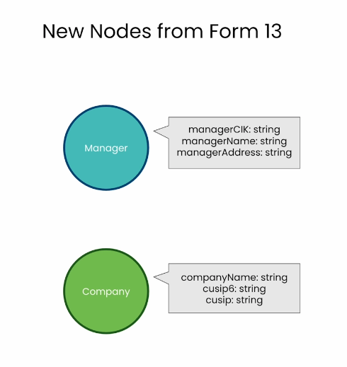

# Lesson 6: Expanding the SEC Knowledge Graph

> 학습 날짜: 2026-09-20
> 상태: ✅ 완료
> 실습 노트북: [L6-expand_the_kg.ipynb](L6-expand_the_kg.ipynb)

## 이 레슨의 목표

- **Form 13**(기관투자자 보유 보고서)을 읽어 `Company`, `Manager` 노드를 만든다
- 식별자(`cusip6`)로 **기존 10-K 그래프와 연결**한다
- 문서에 없는 정보(투자 관계)를 **검색 결과에 덧붙여** LLM에 전달한다

> L5까지는 NetApp 10-K **한 건** 안에서의 구조(`NEXT`, `PART_OF`, `SECTION`)였다.
> 여기서부터는 **문서 바깥의 현실 정보**를 그래프에 붙인다.

## 전체 흐름

```
form13.csv 읽기 → Company 노드 → FILED 관계(기존 Form과 연결)
                → Manager 노드 → OWNS_STOCK_IN 관계(속성 있는 관계)
                → 청크에서 투자자까지 경로 탐색
                → retrieval_query로 투자 정보를 문맥에 주입 → 비교
```

## L5에서 이어지는 지점

지금까지 저장만 해두고 안 쓰던 식별자가 여기서 열쇠가 된다:

| 속성 | 실제 쓰임 |
|---|---|
| `cusip6` | **증권 식별자** → `Company`와 `Form`을 잇는 키 ✅ |
| `cik` | SEC 회사 식별자 (`managerCik`으로 운용사 식별에 사용) |
| `names` | 회사명 목록 → `Company.names`로 복사 |

### L5까지의 그래프

```
(Chunk)-[:NEXT]->(Chunk)-[:NEXT]->(Chunk)
   \          |          /
    \    PART_OF        /
     └──────▶ (Form) ◀──┘
                 │
            [:SECTION]  (각 섹션의 첫 청크로)
```

### L6에서 확장된 그래프

```
(Manager)-[:OWNS_STOCK_IN]->(Company)-[:FILED]->(Form)<-[:PART_OF]-(Chunk)
  투자 기관        보유 정보      피투자 회사     10-K 문서        본문 조각
```

---

## 핵심 개념

### Form 13에서 나오는 새 노드



새로운 데이터 소스인 **Form 13**에서 두 종류의 노드가 추가된다.

| `Manager` (투자 기관) | `Company` (피투자 회사) |
|---|---|
| `managerCik: string` | `cusip: string` |
| `managerName: string` | `cusip6: string` |
| `managerAddress: string` | `companyName: string` |

**Form 13이란**: 일정 규모 이상의 기관투자자가 SEC에 제출하는 **보유 주식 보고서**
(13F). "누가 어느 회사 주식을 얼마나 들고 있는가"가 담긴다.

- **`Manager`** — 자산운용사, 헤지펀드 같은 **투자하는 쪽**.
  `managerCik`은 L4부터 봐온 CIK와 같은 체계의 식별자인데, **운용사의** CIK다
- **`Company`** — 투자를 **받는 쪽**, 즉 NetApp 같은 상장사.
  `cusip`/`cusip6`은 증권 식별 번호

**기존 그래프와의 연결 고리는 `cusip6`이다.**
L4에서 청크에 저장해 둔 `cusip6`이 드디어 쓰인다 —
10-K 문서(`Form`)와 그 회사(`Company`)를 이 값으로 이을 수 있다.

```
[10-K 쪽]                    [Form 13 쪽]
Chunk / Form  ──cusip6──▶  Company  ◀──보유──  Manager
 (문서 내용)                (회사 실체)        (투자 기관)
```

**성격의 전환**: L5까지의 노드(`Chunk`, `Form`)는 **문서에 관한 것**이었다.
`Company`와 `Manager`는 **현실의 주체(엔티티)** 다.
문서 그래프에 실체 그래프가 붙으면서, "이 회사에 투자한 기관은?" 같은
**문서 본문에는 없는 질문**에 답할 수 있게 된다.

> 참고: 같은 회사를 `Form`은 문서 발행자로, `Company`는 투자 대상으로 가리킨다.
> 서로 다른 출처(10-K / Form 13)에서 온 정보를 **식별자로 연결**하는 것이 이 레슨의 요점.

---

## 실습: 그래프 확장하기

### 셋업

L5와 동일. 벡터 인덱스 관련 상수도 그대로 재사용한다.

```python
VECTOR_INDEX_NAME = 'form_10k_chunks'
VECTOR_NODE_LABEL = 'Chunk'
VECTOR_SOURCE_PROPERTY = 'text'
VECTOR_EMBEDDING_PROPERTY = 'textEmbedding'

kg = Neo4jGraph(url=NEO4J_URI, username=NEO4J_USERNAME,
                password=NEO4J_PASSWORD, database=NEO4J_DATABASE)
```

### 1. Form 13 CSV 읽기

```python
import csv

all_form13s = []

with open('./data/form13.csv', mode='r') as csv_file:
    csv_reader = csv.DictReader(csv_file)
    for row in csv_reader:   # 각 행이 dict가 된다
      all_form13s.append(row)

all_form13s[0:5]
len(all_form13s)
```

**NetApp에 투자한 운용사들의 Form 13 모음.**
`csv.DictReader`를 쓰면 각 행이 dict로 나와 **그대로 Cypher 파라미터로** 넘길 수 있다
(L4에서 청크 dict를 통째로 넘기던 것과 같은 방식).

CSV의 컬럼: `managerCik`, `managerName`, `managerAddress`,
`cusip6`, `cusip`, `companyName`, `reportCalendarOrQuarter`, `value`, `shares`

> 이번엔 JSON이 아니라 **CSV**다. 데이터 출처가 달라도 그래프에 합쳐 넣을 수 있다는 점이 포인트.

### 2. `Company` 노드 생성

```python
first_form13 = all_form13s[0]   # 우선 첫 건만

cypher = """
MERGE (com:Company {cusip6: $cusip6})
  ON CREATE
    SET com.companyName = $companyName,
        com.cusip = $cusip
"""

kg.query(cypher, params={
    'cusip6': first_form13['cusip6'],
    'companyName': first_form13['companyName'],
    'cusip': first_form13['cusip']
})
```

`cusip6`를 키로 하는 `MERGE` + `ON CREATE SET` — L4, L5와 같은 패턴.

**회사가 1개뿐인 이유**: 이 CSV는 전부 **NetApp에 대한** 보고서다.
운용사(`Manager`)는 여럿이지만 대상 회사는 하나.

### 3. 회사명 맞추기 + `FILED` 관계

두 데이터 소스가 회사명을 다르게 적고 있는지 먼저 확인한다:

```cypher
MATCH (com:Company), (form:Form)
  WHERE com.cusip6 = form.cusip6
RETURN com.companyName, form.names
```

10-K 쪽의 이름을 `Company`로 복사해 표기를 통일:

```cypher
MATCH (com:Company), (form:Form)
  WHERE com.cusip6 = form.cusip6
SET com.names = form.names
```

**`FILED` 관계 — 두 데이터 소스가 여기서 만난다:**

```cypher
MATCH (com:Company), (form:Form)
  WHERE com.cusip6 = form.cusip6
MERGE (com)-[:FILED]->(form)
```

`(Company)-[:FILED]->(Form)` = "이 회사가 이 10-K를 **제출했다**".
`cusip6`이라는 **공통 식별자**만으로 Form 13 세계와 10-K 세계가 연결된다.

> 이것이 지식 그래프의 힘이다. 출처도 형식(CSV/JSON)도 다른 데이터를,
> **식별자를 매개로** 하나의 그래프로 합칠 수 있다.

### 4. `Manager` 노드 생성

```python
cypher = """
  MERGE (mgr:Manager {managerCik: $managerParam.managerCik})
    ON CREATE
        SET mgr.managerName = $managerParam.managerName,
            mgr.managerAddress = $managerParam.managerAddress
"""

kg.query(cypher, params={'managerParam': first_form13})
```

**유니크 제약** (L4의 `unique_chunk`와 같은 목적):

```cypher
CREATE CONSTRAINT unique_manager
  IF NOT EXISTS
  FOR (n:Manager)
  REQUIRE n.managerCik IS UNIQUE
```

### 전문 검색 인덱스 (Fulltext Index) — 새로 나온 개념

```cypher
CREATE FULLTEXT INDEX fullTextManagerNames
  IF NOT EXISTS
  FOR (mgr:Manager)
  ON EACH [mgr.managerName]
```

```cypher
CALL db.index.fulltext.queryNodes("fullTextManagerNames",
    "royal bank") YIELD node, score
RETURN node.managerName, score
```

`"royal bank"`로 검색하면 *Royal Bank of Canada* 같은 이름들이 걸린다.

**세 가지 검색 방식이 이제 다 나왔다:**

| 방식 | 문법 | 특징 |
|---|---|---|
| 정확 일치 | `MATCH (m {name: "..."})` | 글자가 똑같아야 함 (L2) |
| **전문 검색** | `db.index.fulltext.queryNodes` | **단어 기반**, 부분/대소문자 무관 |
| 벡터 검색 | `db.index.vector.queryNodes` | **의미 기반**, 단어가 달라도 됨 (L3) |

전문 검색은 **고유명사에 강하다.** 회사명·사람 이름은 의미가 아니라
철자로 찾아야 하므로 임베딩보다 이쪽이 적합하다.
반환 형태(`YIELD node, score`)는 벡터 검색과 같다.

**전체 운용사 생성:**

```python
for form13 in all_form13s:
  kg.query(cypher, params={'managerParam': form13})
```

```cypher
MATCH (mgr:Manager) RETURN count(mgr)
```

`MERGE`이므로 같은 운용사가 여러 행에 나와도 노드는 하나만 생긴다.

### 5. `OWNS_STOCK_IN` 관계 — 속성이 핵심인 관계

먼저 양쪽 노드가 제대로 잡히는지 확인:

```cypher
MATCH (mgr:Manager {managerCik: $investmentParam.managerCik}),
      (com:Company {cusip6: $investmentParam.cusip6})
RETURN mgr.managerName, com.companyName, $investmentParam as investment
```

관계 생성:

```cypher
MATCH (mgr:Manager {managerCik: $ownsParam.managerCik}),
      (com:Company {cusip6: $ownsParam.cusip6})
MERGE (mgr)-[owns:OWNS_STOCK_IN {
    reportCalendarOrQuarter: $ownsParam.reportCalendarOrQuarter
}]->(com)
ON CREATE
    SET owns.value  = toFloat($ownsParam.value),
        owns.shares = toInteger($ownsParam.shares)
RETURN mgr.managerName, owns.reportCalendarOrQuarter, com.companyName
```

**여기서 관계 속성이 본격적으로 쓰인다.** L5의 `SECTION {f10kItem: ...}`보다 한 걸음 나아간 형태:

- `MERGE (...)-[owns:OWNS_STOCK_IN {reportCalendarOrQuarter: ...}]->(...)`
  → **분기(quarter)까지 포함해서** 관계를 식별한다.
  같은 운용사·같은 회사라도 **분기가 다르면 별개의 관계**가 된다
- `ON CREATE SET`으로 `value`(평가금액), `shares`(보유 주식 수)를 채운다
- `toFloat()`, `toInteger()` — **CSV는 모든 값이 문자열**이므로 형변환이 필요하다.
  안 하면 숫자 비교·정렬이 문자열 기준으로 잘못 동작한다

> **정보가 관계에 실려 있다**는 점이 중요하다. "얼마나 보유했는가"는
> 운용사의 속성도 회사의 속성도 아니고, **둘 사이 관계의 속성**이다.
> 관계형 DB라면 별도 테이블이 필요한 정보다.

확인:

```cypher
MATCH (mgr:Manager {managerCik: $ownsParam.managerCik})
-[owns:OWNS_STOCK_IN]->
      (com:Company {cusip6: $ownsParam.cusip6})
RETURN owns { .shares, .value }
```

`owns { .shares, .value }` — **관계에도 map projection**을 쓸 수 있다 (L5에서 노드에 쓰던 문법).

**전체 관계 생성:**

```python
for form13 in all_form13s:
  kg.query(cypher, params={'ownsParam': form13})
```

```cypher
MATCH (:Manager)-[owns:OWNS_STOCK_IN]->(:Company)
RETURN count(owns) as investments
```

```python
kg.refresh_schema()
print(textwrap.fill(kg.schema, 60))
```

### 6. 청크에서 투자자까지 — 경로 따라가기

다시 단계적으로 쌓아올린다. 기준이 될 청크 하나를 잡고:

```python
chunk_rows = kg.query("MATCH (chunk:Chunk) RETURN chunk.chunkId as chunkId LIMIT 1")
ref_chunk_id = chunk_rows[0]['chunkId']
```

**① 청크 → 폼**

```cypher
MATCH (:Chunk {chunkId: $chunkIdParam})-[:PART_OF]->(f:Form)
RETURN f.source
```

**② 청크 → 폼 → 회사**

```cypher
MATCH (:Chunk {chunkId: $chunkIdParam})-[:PART_OF]->(f:Form),
    (com:Company)-[:FILED]->(f)
RETURN com.companyName as name
```

**③ 청크 → 폼 → 회사 → 투자자 수**

```cypher
MATCH (:Chunk {chunkId: $chunkIdParam})-[:PART_OF]->(f:Form),
      (com:Company)-[:FILED]->(f),
      (mgr:Manager)-[:OWNS_STOCK_IN]->(com)
RETURN com.companyName,
       count(mgr.managerName) as numberOfinvestors
LIMIT 1
```

**본문 한 조각에서 출발해 투자자 수에 도달했다.**
이 정보는 10-K 본문 어디에도 없다 — **관계를 따라가서 얻은 것**이다.
콤마로 여러 패턴을 잇고, 공통 변수(`f`, `com`)가 조인 역할을 한다.

### 7. LLM에 줄 문맥을 Cypher로 만들기

검색 결과를 **문장으로 조립**한다:

```cypher
MATCH (:Chunk {chunkId: $chunkIdParam})-[:PART_OF]->(f:Form),
    (com:Company)-[:FILED]->(f),
    (mgr:Manager)-[owns:OWNS_STOCK_IN]->(com)
RETURN mgr.managerName + " owns " + owns.shares +
    " shares of " + com.companyName +
    " at a value of $" +
    apoc.number.format(toInteger(owns.value)) AS text
LIMIT 10
```

결과 예: `"Royal Bank of Canada owns 123456 shares of NETAPP INC at a value of $12,345,678"`

- 문자열 `+` 연결로 **자연어 문장**을 만든다. LLM이 읽을 것이므로
- `apoc.number.format()` — 숫자에 천 단위 쉼표를 넣어 읽기 좋게

> **그래프 데이터를 LLM이 이해할 형태로 번역하는 단계**다.
> 노드와 관계를 그대로 던지는 게 아니라 문장으로 풀어준다.

---

## 실습: 투자 정보로 RAG 보강하기

### 비교군 — 순수 벡터 검색 체인

```python
vector_store = Neo4jVector.from_existing_graph(
    embedding=OpenAIEmbeddings(),
    url=NEO4J_URI, username=NEO4J_USERNAME, password=NEO4J_PASSWORD,
    index_name=VECTOR_INDEX_NAME,
    node_label=VECTOR_NODE_LABEL,
    text_node_properties=[VECTOR_SOURCE_PROPERTY],
    embedding_node_property=VECTOR_EMBEDDING_PROPERTY,
)
retriever = vector_store.as_retriever()
plain_chain = RetrievalQAWithSourcesChain.from_chain_type(
    ChatOpenAI(temperature=0), chain_type="stuff", retriever=retriever
)
```

### 투자 정보 주입 체인

```python
investment_retrieval_query = """
MATCH (node)-[:PART_OF]->(f:Form),
    (f)<-[:FILED]-(com:Company),
    (com)<-[owns:OWNS_STOCK_IN]-(mgr:Manager)
WITH node, score, mgr, owns, com
    ORDER BY owns.shares DESC LIMIT 10
WITH collect (
    mgr.managerName +
    " owns " + owns.shares +
    " shares in " + com.companyName +
    " at a value of $" +
    apoc.number.format(toInteger(owns.value)) + "."
) AS investment_statements, node, score
RETURN apoc.text.join(investment_statements, "\n") +
    "\n" + node.text AS text,
    score,
    {
      source: node.source
    } as metadata
"""
```

한 줄씩:

1. `MATCH (node)-[:PART_OF]->(f:Form), (f)<-[:FILED]-(com), (com)<-[owns]-(mgr)`
   → 검색된 청크(`node`)에서 출발해 **폼 → 회사 → 투자자**까지 따라간다.
   화살표가 `<-`로 뒤집힌 데 주의 — `FILED`와 `OWNS_STOCK_IN`은
   회사/운용사에서 나가는 방향이므로 역방향으로 탄다
2. `ORDER BY owns.shares DESC LIMIT 10` → **보유량 상위 10개**만.
   관계 속성으로 정렬하는 실제 사례
3. `collect(...)` → 투자 문장들을 **리스트로** 모은다
4. `apoc.text.join(..., "\n") + "\n" + node.text`
   → 투자 문장들 **+ 원래 청크 본문**을 하나로 합쳐 LLM에 전달

**L5의 윈도우 쿼리와 비교하면 확장 방향이 다르다:**

| | L5 윈도우 | L6 투자 정보 |
|---|---|---|
| 확장 경로 | `NEXT` (같은 문서 안) | `PART_OF`→`FILED`→`OWNS_STOCK_IN` (문서 밖) |
| 가져오는 것 | 앞뒤 청크의 **본문** | 문서에 **없는 외부 정보** |
| 성격 | 맥락을 **넓힘** | 지식을 **더함** |

```python
vector_store_with_investment = Neo4jVector.from_existing_index(
    OpenAIEmbeddings(),
    url=NEO4J_URI, username=NEO4J_USERNAME, password=NEO4J_PASSWORD,
    database="neo4j",
    index_name=VECTOR_INDEX_NAME,
    text_node_property=VECTOR_SOURCE_PROPERTY,
    retrieval_query=investment_retrieval_query,
)
retriever_with_investments = vector_store_with_investment.as_retriever()
investment_chain = RetrievalQAWithSourcesChain.from_chain_type(
    ChatOpenAI(temperature=0), chain_type="stuff", retriever=retriever_with_investments
)
```

### 비교 — 질문에 따라 결과가 갈린다

**질문 1: 투자와 무관한 질문**

```python
question = "In a single sentence, tell me about Netapp."
plain_chain({"question": question}, return_only_outputs=True)
investment_chain({"question": question}, return_only_outputs=True)
```

→ **두 답변이 거의 같다.** 투자 정보를 문맥에 넣어줬지만
질문이 투자를 묻지 않았으므로 LLM이 **쓰지 않았다.**

**질문 2: 투자자에 대한 질문**

```python
question = "In a single sentence, tell me about Netapp investors."
plain_chain({"question": question}, return_only_outputs=True)
investment_chain({"question": question}, return_only_outputs=True)
```

→ 여기서 갈린다.
- `plain_chain` — 10-K 본문에 투자자 명단이 없으므로 **제대로 답하지 못한다**
- `investment_chain` — 구체적인 운용사 이름과 보유 규모로 답한다

**교훈**: 문맥을 더 준다고 항상 답이 좋아지는 게 아니다.
**질문이 그 정보를 필요로 할 때** 비로소 효과가 난다.
불필요한 문맥은 토큰만 소모하고 때로는 노이즈가 된다.

---

## 배운 점 / 인사이트

- **서로 다른 출처의 데이터를 식별자로 잇는 것**이 이 레슨의 본질이다.
  JSON(10-K)과 CSV(Form 13)라는 다른 형식, 다른 출처의 데이터가
  `cusip6` 하나로 연결됐다. L4에서 무심코 저장해 둔 값이 여기서 제 역할을 한다
- **관계가 정보를 담는다.** `OWNS_STOCK_IN`의 `shares`, `value`, `reportCalendarOrQuarter`는
  어느 노드에도 속하지 않는, 오직 **관계에만 있을 수 있는** 정보다.
  관계 속성으로 `MERGE` 키를 삼아 분기별 보유 이력을 따로 관리하는 방식도 배웠다
- **검색 확장의 두 방향**을 L5·L6에서 각각 봤다 —
  같은 문서 안에서 **넓히기**(`NEXT`), 문서 밖으로 **나가기**(`FILED`/`OWNS_STOCK_IN`).
  후자가 벡터 DB로는 불가능한, 그래프만의 영역이다
- **전문 검색(fulltext)** 이 추가되면서 검색 수단이 세 가지가 됐다.
  고유명사는 fulltext, 의미는 vector, 정확한 키는 MATCH — 용도가 다르다
- 그래프 데이터를 **자연어 문장으로 번역해서** LLM에 주는 패턴.
  LLM은 노드/관계 구조를 모르므로 문장으로 풀어줘야 한다
- 문맥을 더 준다고 답이 항상 좋아지지 않는다. **질문과 문맥이 맞아떨어져야** 한다

## 헷갈렸던 점 / 질문

### Q. `Company`와 `Form`은 뭐가 다른가? (L5의 `Chunk` vs `Form`에 이어서)

책 비유를 확장하면:

```
Manager = 그 책을 산 사람/기관
Company = 책을 쓴 저자(현실의 주체)
Form    = 책 한 권 자체
Chunk   = 책의 한 페이지
```

- `Form` — **문서**. "NetApp이 2023년에 제출한 10-K라는 서류"
- `Company` — **회사 실체**. 문서를 제출하기도 하고, 투자를 받기도 하는 주체

그래서 `(Company)-[:FILED]->(Form)`이 성립한다. 회사가 문서를 제출한 것이니까.

### Q. `toFloat()`, `toInteger()`는 왜 필요한가?

**CSV로 읽으면 모든 값이 문자열**이기 때문이다.
`"123456"` 그대로 저장하면 `ORDER BY owns.shares DESC`가
숫자가 아니라 **사전순**으로 정렬된다 (`"9" > "123456"`).
형변환을 해둬야 정렬·비교·집계가 제대로 동작한다.

### Q. `retrieval_query`에서 화살표가 왜 `<-` 로 뒤집혔나?

```cypher
MATCH (node)-[:PART_OF]->(f:Form),
    (f)<-[:FILED]-(com:Company),
    (com)<-[owns:OWNS_STOCK_IN]-(mgr:Manager)
```

관계를 만들 때 정한 방향이 `(Company)-[:FILED]->(Form)`,
`(Manager)-[:OWNS_STOCK_IN]->(Company)` 이기 때문이다.
청크에서 출발해 거슬러 올라가려면 **역방향으로 타야** 한다.
L2의 공동 출연자(`<-[:ACTED_IN]-`), L5의 preceding 청크와 같은 원리.

### Q. 전문 검색(fulltext)과 벡터 검색은 언제 뭘 쓰나?

- **fulltext** — 고유명사, 이름, 코드처럼 **철자로 찾아야 하는 것**.
  "royal bank"로 *Royal Bank of Canada*를 찾는 식
- **vector** — 의미로 찾아야 하는 것. "adventure"로 모험 영화를 찾는 식

이름을 임베딩으로 찾으면 엉뚱한 회사가 걸리기 쉽다.
반대로 개념을 fulltext로 찾으면 단어가 정확히 일치해야만 걸린다.

### Q. 왜 `Company` 노드가 하나뿐인가?

이 CSV가 전부 **NetApp 한 회사에 대한** Form 13이기 때문이다.
투자한 운용사(`Manager`)는 여럿이지만 투자 대상은 하나.
실제 데이터라면 회사도 여럿이 된다.

## 다음 레슨과의 연결

L7에서는 지금까지 만든 그래프 위에서 **챗봇**을 구성한다.
사용자의 자연어 질문을 Cypher로 바꾸거나, 여러 검색 방식을 조합해
대화형으로 그래프에 질의하는 단계로 넘어간다.

## 참고

- 강의: [Expanding the SEC Knowledge Graph](https://learn.deeplearning.ai/courses/knowledge-graphs-rag)
- [이전 레슨: Adding Relationships to the SEC Knowledge Graph](<../05-adding-relationships-to-the-sec-knowledge-graph/05-adding-relationships-to-the-sec-knowledge-graph.md>)
- [SEC Form 13F](https://www.sec.gov/divisions/investment/13ffaq)
- [Neo4j Fulltext indexes](https://neo4j.com/docs/cypher-manual/current/indexes/semantic-indexes/full-text-indexes/)
