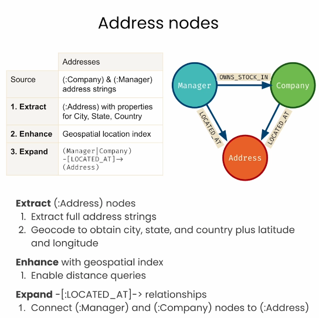
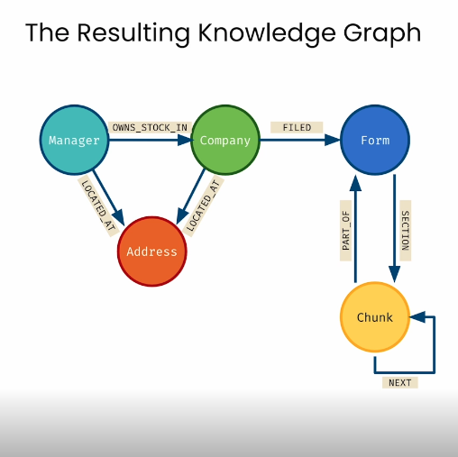

# Lesson 7: Chatting with the SEC Knowledge Graph

> 학습 날짜: 2026-09-21
> 상태: ✅ 완료
> 실습 노트북: [L7-chat_with_kg.ipynb](L7-chat_with_kg.ipynb)

## 이 레슨의 목표

- **위치 정보**(`Address`)가 추가된 그래프를 탐색한다 — 집계, 근접 질의
- 사용자의 **자연어 질문을 Cypher로 번역**하는 체인(`GraphCypherQAChain`)을 만든다
- **few-shot 예시**를 프롬프트에 추가해가며 LLM이 쓰는 Cypher를 길들인다

> L3~L6은 "내가 쓴 Cypher"로 검색했다.
> 여기서부터는 **LLM이 Cypher를 쓴다.** 사람은 질문만 한다.

## 전체 흐름

```
주소가 추가된 그래프 확인 (kg.refresh_schema)
  → 집계 질의 (주별/도시별 운용사 수)
  → 근접 질의 (point.distance)
  → 전문 검색 + 근접 질의 조합
  → GraphCypherQAChain 구성 (스키마를 프롬프트에 주입)
  → 실패하는 질문 발견 → 예시 추가 → 재구성 → 통과  ⟳
```

---

## 회고: 지식 그래프는 어떻게 만드는가 (MVG)

L3~L6에서 한 일을 한 장으로 요약하면 이렇다.

> **MVG(Minimum Viable Graph)로 시작한 뒤,
> Extract → Enhance → Expand 를 반복해서 그래프를 키운다.**

| 단계 | 하는 일 |
|---|---|
| **Extract** | 흥미로운 정보를 **찾아낸다** (identify interesting information) |
| **Enhance** | 데이터를 **강화한다** (supercharge the data) |
| **Expand** | 정보를 **연결해 문맥을 넓힌다** (connect information to expand context) |

핵심은 **"완성된 스키마를 먼저 설계하지 않는다"** 는 것이다.
쓸 수 있는 최소한의 그래프를 먼저 만들고, 필요할 때마다 세 단계를 다시 돈다.

### 텍스트에서 MVG까지 — Extract

```
1. Form 10-K        2. Split text              3. Create nodes

  ┌────────┐        ┌──────────────────┐        ╭──────────╮
  │ Form   │───┬───▶│ Lorem ipsum ...  │───┐    │          │
  │ 10-K   │   ├───▶│ adipiscing elit  │───┤    │  Chunk   │
  │  (json)│   ├───▶│ incididunt ut .. │───┼───▶│  Chunk   │
  └────────┘   ├───▶│ enim ad minim .. │───┤    │  Chunk   │
               └───▶│ exercitation ... │───┘    │  Chunk   │
                    └──────────────────┘        ╰──────────╯
  └──────────────────── Extract ────────────────────────┘
```

원본 문서 → **텍스트 분할** → **`Chunk` 노드 생성**.
이 시점의 그래프는 관계가 하나도 없는 **노드 더미**다. 그래도 MVG로는 충분하다 (L4).

### 연결해서 넓히기 — Expand

```
                   5. Connect

  ╭───────╮  NEXT   ╭───────╮  NEXT   ╭───────╮
  │ Chunk │────────▶│ Chunk │────────▶│ Chunk │
  ╰───────╯         ╰───────╯         ╰───────╯

  └───────────────── Expand ─────────────────┘
```

`NEXT`로 청크를 순서대로 잇는 순간, **"앞뒤 문맥을 가져오는" 검색**이 가능해진다 (L5).
노드만 있을 때는 불가능했던 일이다.

### SEC Forms로 본 Extract / Enhance / Expand 전체 표

| | **Chunked Text Nodes** | **Form 10-K Nodes** | **Companies** | **Management Firms** |
|---|---|---|---|---|
| **Source** | Form 10-K json | `(:Chunk)` | Form 13 CSV | Form 13 CSV |
| **1. Extract** | `(:Chunk)` | `(:Form)` | `(:Company)` | `(:Manager)` |
| **2. Enhance** | 텍스트의 **벡터 임베딩** | 유니크한 **chunk ID** | 유니크한 **cusip6** | 이름의 **전문 검색 인덱스** |
| **3. Expand** | `(Chunk)-[:NEXT]->(Chunk)` | `(Chunk)-[:PART_OF]->(Form)` | `(Company)-[:FILED]->(Form)` | `(Manager)-[:OWNS_STOCK_IN]->(Company)` |

표를 가로로 읽으면 **각 단계가 무슨 일을 하는지**가 보인다:

- **Extract** — 출처에서 노드를 뽑는다. 출처가 json이든 CSV든, 심지어 **이미 만든 노드**(`(:Chunk)`에서 `(:Form)`을 뽑았다)든 상관없다
- **Enhance** — 노드를 **검색 가능하게** 만든다. 임베딩(의미), 유니크 ID/제약(정확 일치), 전문 인덱스(단어)
- **Expand** — 관계를 건다. 문서 안(`NEXT`, `PART_OF`)에서 문서 밖(`FILED`, `OWNS_STOCK_IN`)으로 뻗어나간다

> **Enhance가 검색 방식을 결정한다.** 임베딩을 붙였으니 벡터 검색이,
> 전문 인덱스를 만들었으니 이름 검색이, 유니크 키를 걸었으니 정확 조회가 가능해진 것이다.
> L7의 Text2Cypher는 이렇게 쌓아 올린 그래프 위에서야 비로소 성립한다.

---

## 핵심 개념

### 1. 속성 → 노드 승격 (`Address`)



L6의 4열 매트릭스에 **다섯 번째 열이 추가되는 것**으로 보면 이해가 빠르다.

| | **Addresses** |
|---|---|
| **Source** | `(:Company)` & `(:Manager)`의 **주소 문자열** |
| **1. Extract** | City, State, Country 속성을 가진 `(:Address)` |
| **2. Enhance** | **지리 공간 인덱스**(geospatial location index) |
| **3. Expand** | `(Manager\|Company)-[:LOCATED_AT]->(Address)` |

**Extract** — `(:Address)` 노드 만들기
1. 전체 주소 문자열을 뽑아낸다
2. **지오코딩(geocode)** 해서 city / state / country + **위도·경도**를 얻는다

**Enhance** — 지리 공간 인덱스를 건다
1. **거리 질의(distance queries)** 가 가능해진다

**Expand** — `-[:LOCATED_AT]->` 관계
1. `(:Manager)`와 `(:Company)`를 `(:Address)`에 연결한다

```
   (Manager) ──OWNS_STOCK_IN──▶ (Company)
       │                            │
   LOCATED_AT                  LOCATED_AT
       └────────▶ (Address) ◀───────┘
```

> ⚠️ **이 작업은 노트북에 코드로 나오지 않는다.** L7 노트북은
> **이미 주소가 추가된 그래프**로 시작한다 (강의 영상에서 설명하는 부분).
> 노트북에서 하는 일은 그 결과를 **탐색하고 질문하는 것**이다.

**언제 속성을 노드로 올려야 하나** — 판단 기준:

| 속성으로 둔다 | 노드로 올린다 |
|---|---|
| 그 노드 하나에만 딸린 값 | **여러 노드가 공유**하는 값 |
| 검색 조건으로 안 쓰임 | 그 값 **자체로 질의**하고 싶음 |
| 예: `shares`, `value` | 예: 주소, 도시, 산업분류 |

**주소 노드를 운용사와 회사가 공유한다**는 점이 핵심이다.
같은 도시에 있는 주체들이 하나의 `Address`로 모이면서
"이 회사 근처의 투자사는?" 같은 **삼각 질의**가 가능해진다.

**출처가 "이미 그래프 안에 있는 데이터"라는 점도 주목할 만하다.**
새 파일을 읽어온 게 아니라, L6에서 저장해 둔 주소 문자열을 **다시 Extract** 했다.
MVG 사이클은 외부 데이터뿐 아니라 **자기 자신에게도 적용된다.**

### 완성된 지식 그래프



L1부터 쌓아온 것이 여기서 한 장으로 모인다. 크게 **두 덩어리**다.

```
[현실 세계]                                  [문서 세계]

(Manager)──OWNS_STOCK_IN──▶(Company)──FILED──▶(Form)
    │                          │                 ▲   │
 LOCATED_AT              LOCATED_AT         PART_OF  SECTION
    └────────▶(Address)◀───────┘                 │   ▼
                                              (Chunk)⤾ NEXT
```

| 덩어리 | 노드 | 만든 레슨 |
|---|---|---|
| **문서 세계** | `Chunk`, `Form` | L4, L5 |
| **현실 세계** | `Company`, `Manager` | L6 |
| **위치** | `Address` | L7 |

**두 세계를 잇는 다리는 `FILED` 하나다.**
`(Company)-[:FILED]->(Form)` — `cusip6` 식별자로 만든 이 관계 덕분에,
본문 청크 하나에서 출발해 그 회사의 투자자와 소재지까지 도달할 수 있다.

관계별로 보면 각각 다른 종류의 질문을 담당한다:

| 관계 | 답할 수 있는 질문 |
|---|---|
| `NEXT` | 이 대목의 앞뒤 맥락은? (L5) |
| `PART_OF` / `SECTION` | 이 내용은 어느 문서 어느 항목에? (L5) |
| `FILED` | 이 문서를 낸 회사는? (L6) |
| `OWNS_STOCK_IN` | 누가 얼마나 투자했나? (L6) |
| `LOCATED_AT` | 어디에 있나? 서로 가까운가? (L7) |

> L7의 챗봇이 하는 일은 결국 **이 그림 위에서 길을 찾는 것**이다.
> LLM에게 스키마를 주는 것 = 이 지도를 건네주는 것이고,
> 생성된 Cypher가 틀렸다는 건 **길을 잘못 들었다**는 뜻이다.

### 2. `point` 타입 — 지리 질의

Neo4j는 **공간 데이터 타입**을 기본 제공한다.

- `point.distance(a, b)` → **미터** 단위 거리
- `WHERE point.distance(...) < 10000` → 10km 이내
- `ORDER BY point.distance(...)` → 가까운 순 정렬

**검색 수단이 네 가지가 됐다:**

| 방식 | 문법 | 찾는 기준 | 레슨 |
|---|---|---|---|
| 정확 일치 | `MATCH (m {name: "..."})` | 글자 | L2 |
| 벡터 검색 | `db.index.vector.queryNodes` | 의미 | L3 |
| 전문 검색 | `db.index.fulltext.queryNodes` | 단어 | L6 |
| **공간 검색** | `point.distance` | **거리** | **L7** |

---

## 실습 1: 주소가 추가된 그래프 탐색하기

### 셋업 — 새로 들어온 import

```python
from langchain.prompts.prompt import PromptTemplate
from langchain.chains import GraphCypherQAChain
```

나머지(`Neo4jGraph`, `Neo4jVector`, `OpenAIEmbeddings`, 상수들)는 L6과 동일하다.

```python
kg = Neo4jGraph(url=NEO4J_URI, username=NEO4J_USERNAME,
                password=NEO4J_PASSWORD, database=NEO4J_DATABASE)

kg.refresh_schema()
print(textwrap.fill(kg.schema, 60))
```

스키마에 `Address` 노드와 `LOCATED_AT` 관계가 보인다.
**이 출력이 곧 뒤에서 LLM 프롬프트에 주입될 `{schema}`** 다.

### 주소 확인

```cypher
MATCH (mgr:Manager)-[:LOCATED_AT]->(addr:Address)
RETURN mgr, addr
LIMIT 1
```

### 전문 검색으로 운용사 찾기 (L6 복습)

```cypher
CALL db.index.fulltext.queryNodes("fullTextManagerNames", "royal bank")
  YIELD node, score
RETURN node.managerName, score LIMIT 1
```

**전문 검색 → 위치 조회로 이어붙이기:**

```cypher
CALL db.index.fulltext.queryNodes("fullTextManagerNames", "royal bank")
  YIELD node, score
WITH node as mgr LIMIT 1
MATCH (mgr:Manager)-[:LOCATED_AT]->(addr:Address)
RETURN mgr.managerName, addr
```

`WITH node as mgr LIMIT 1` — **검색 결과를 다음 `MATCH`의 출발점으로** 넘긴다.
`CALL ... YIELD` 다음에 `WITH`로 이름을 바꿔주는 것이 패턴이다.

### 집계 질의 — 어디에 몰려 있나

```cypher
// 운용사가 가장 많은 주(state)
MATCH p=(:Manager)-[:LOCATED_AT]->(address:Address)
RETURN address.state as state, count(address.state) as numManagers
  ORDER BY numManagers DESC
  LIMIT 10
```

```cypher
// 회사가 가장 많은 주
MATCH p=(:Company)-[:LOCATED_AT]->(address:Address)
RETURN address.state as state, count(address.state) as numCompanies
  ORDER BY numCompanies DESC
```

```cypher
// 캘리포니아에서 운용사가 가장 많은 도시
MATCH p=(:Manager)-[:LOCATED_AT]->(address:Address)
  WHERE address.state = 'California'
RETURN address.city as city, count(address.city) as numManagers
  ORDER BY numManagers DESC
  LIMIT 10
```

```cypher
// 캘리포니아에서 회사가 가장 많은 도시
MATCH p=(:Company)-[:LOCATED_AT]->(address:Address)
  WHERE address.state = 'California'
RETURN address.city as city, count(address.city) as numCompanies
  ORDER BY numCompanies DESC
```

> **벡터 RAG로는 절대 못 하는 질의다.** "몇 개", "가장 많은"은
> 집계 함수의 영역이고, 유사도 검색에는 그런 개념이 없다.

### 관계 속성까지 엮은 집계

```cypher
// 샌프란시스코의 투자 규모 상위 운용사
MATCH p=(mgr:Manager)-[:LOCATED_AT]->(address:Address),
       (mgr)-[owns:OWNS_STOCK_IN]->(:Company)
  WHERE address.city = "San Francisco"
RETURN mgr.managerName, sum(owns.value) as totalInvestmentValue
  ORDER BY totalInvestmentValue DESC
  LIMIT 10
```

**두 축이 한 쿼리에서 만난다** — 위치(`LOCATED_AT`)로 거르고,
투자 관계의 속성(`owns.value`)으로 합산한다.
L6에서 `OWNS_STOCK_IN`에 넣어둔 값이 여기서 `sum()`으로 쓰인다.

### 근접 질의 — "in" vs "near"

```cypher
// Santa Clara에 "있는" 회사 — 속성 일치
MATCH (com:Company)-[:LOCATED_AT]->(address:Address)
  WHERE address.city = "Santa Clara"
RETURN com.companyName
```

```cypher
// Santa Clara "근처의" 회사 — 거리 계산
MATCH (sc:Address)
  WHERE sc.city = "Santa Clara"
MATCH (com:Company)-[:LOCATED_AT]->(comAddr:Address)
  WHERE point.distance(sc.location, comAddr.location) < 10000
RETURN com.companyName, com.companyAddress
```

**이 대비가 이 레슨의 핵심 중 하나다.**

| | "in Santa Clara" | "near Santa Clara" |
|---|---|---|
| 조건 | `address.city = "Santa Clara"` | `point.distance(...) < 10000` |
| 기준 | **행정 구역** | **실제 거리** |
| 놓치는 것 | 길 건너 다른 시에 있는 곳 | — |

도시 경계는 사람이 그은 선이라 "가까움"과 일치하지 않는다.
실리콘밸리처럼 시가 촘촘한 지역에서는 차이가 크다.

```cypher
// Santa Clara 근처의 운용사 (반경 20km)
MATCH (address:Address)
  WHERE address.city = "Santa Clara"
MATCH (mgr:Manager)-[:LOCATED_AT]->(managerAddress:Address)
  WHERE point.distance(address.location, managerAddress.location) < 20000
RETURN mgr.managerName, mgr.managerAddress
```

숫자를 바꿔가며 **반경을 조절**해볼 수 있다.

### 전문 검색 + 근접 질의 조합 — 오타까지 견딘다

```cypher
// "Palo Aalto Networks" — 오타가 있는 채로 검색!
CALL db.index.fulltext.queryNodes("fullTextCompanyNames", "Palo Aalto Networks")
  YIELD node, score
WITH node as com
MATCH (com)-[:LOCATED_AT]->(comAddress:Address),
      (mgr:Manager)-[:LOCATED_AT]->(mgrAddress:Address)
  WHERE point.distance(comAddress.location, mgrAddress.location) < 10000
RETURN mgr,
       toInteger(point.distance(comAddress.location,
           mgrAddress.location) / 1000) as distanceKm
  ORDER BY distanceKm ASC
  LIMIT 10
```

- **전문 검색은 오타에 강하다.** `Aalto` → *Palo Alto Networks*를 찾아낸다.
  정확 일치(`=`)였다면 0건이었을 것이다
- `fullTextCompanyNames` — 회사명 전문 인덱스도 있다 (L6의 운용사용 인덱스에 더해)
- `point.distance(...) / 1000` + `toInteger()` → **km로 변환해서 표시**
- `ORDER BY distanceKm ASC` → 가까운 순

**세 가지 기법이 한 쿼리 안에 다 들어있다** — 전문 검색으로 시작점을 찾고,
관계를 따라가고, 거리로 거르고 정렬한다. 이 정도 쿼리를
**LLM이 스스로 쓰게 만드는 것**이 다음 절의 목표다.

---

## 실습 2: LLM에게 Cypher 작성 가르치기

### `GraphCypherQAChain`

```python
CYPHER_GENERATION_PROMPT = PromptTemplate(
    input_variables=["schema", "question"],
    template=CYPHER_GENERATION_TEMPLATE
)

cypherChain = GraphCypherQAChain.from_llm(
    ChatOpenAI(temperature=0),
    graph=kg,
    verbose=True,
    cypher_prompt=CYPHER_GENERATION_PROMPT,
)

def prettyCypherChain(question: str) -> str:
    response = cypherChain.run(question)
    print(textwrap.fill(response, 60))
```

**내부에서 일어나는 일 (2단계 LLM 호출):**

```
질문 ─▶ [LLM #1] 스키마 + 예시를 보고 Cypher 생성
              ▼
        Neo4j에서 실행 → 결과(행 목록)
              ▼
        [LLM #2] 결과를 읽고 자연어 답변 작성 ─▶ 답
```

- `verbose=True` — **생성된 Cypher가 그대로 출력된다.** 디버깅의 핵심
- `temperature=0` — Cypher에 창의성은 필요 없다. 같은 질문엔 같은 쿼리가 나와야 한다
- `graph=kg` — 여기서 스키마를 가져와 `{schema}`에 채운다

### 프롬프트 템플릿

```python
CYPHER_GENERATION_TEMPLATE = """Task:Generate Cypher statement to
query a graph database.
Instructions:
Use only the provided relationship types and properties in the
schema. Do not use any other relationship types or properties that
are not provided.
Schema:
{schema}
Note: Do not include any explanations or apologies in your responses.
Do not respond to any questions that might ask anything else than
for you to construct a Cypher statement.
Do not include any text except the generated Cypher statement.
Examples: Here are a few examples of generated Cypher
statements for particular questions:

# What investment firms are in San Francisco?
MATCH (mgr:Manager)-[:LOCATED_AT]->(mgrAddress:Address)
    WHERE mgrAddress.city = 'San Francisco'
RETURN mgr.managerName
The question is:
{question}"""
```

구성 요소를 뜯어보면:

| 부분 | 역할 |
|---|---|
| **Task** | 무엇을 할지 (Cypher 생성) |
| **Instructions** | 스키마에 있는 것만 써라 → **환각 방지** |
| `{schema}` | 그래프 구조 자동 주입 — **가장 중요** |
| **Note** | 설명·사과 금지, **Cypher만** 출력 |
| **Examples** | few-shot. 늘려가며 개선할 부분 |
| `{question}` | 사용자 질문 |

> "설명하지 마라, Cypher만 내놔라"가 왜 필요한가 —
> LLM이 "이 쿼리는 ~를 조회합니다" 같은 말을 붙이면 **실행이 깨진다.**

### 예시 1개로 시작 → 어디서 깨지는지 본다

```python
prettyCypherChain("What investment firms are in San Francisco?")   # ✅ 예시 그대로
prettyCypherChain("What investment firms are in Menlo Park?")      # ✅ 도시만 바꿔 일반화
prettyCypherChain("What companies are in Santa Clara?")            # ✅ Manager→Company 유추
prettyCypherChain("What investment firms are near Santa Clara?")   # ❌ "near"를 모른다
```

앞의 세 개는 통과한다. **예시 하나로 "도시로 필터링"이라는 패턴을 익혔고,
`Manager`를 `Company`로 바꾸는 것까지 스스로 해냈다.**

하지만 네 번째, **"near"** 에서 무너진다.
LLM 입장에서 `point.distance`를 써야 한다는 걸 알 길이 없다 —
스키마에는 `location` 속성이 있다고만 나오지, **어떻게 쓰는지**는 없다.

> **이것이 few-shot이 필요한 이유다.** 스키마는 *무엇이 있는지*를 알려주지만,
> 예시는 *어떻게 쓰는지*를 알려준다.

### 예시 2개 — 근접 질의 가르치기

프롬프트에 두 번째 예시를 추가한다:

```
# What investment firms are near Santa Clara?
  MATCH (address:Address)
    WHERE address.city = "Santa Clara"
  MATCH (mgr:Manager)-[:LOCATED_AT]->(managerAddress:Address)
    WHERE point.distance(address.location,
        managerAddress.location) < 10000
  RETURN mgr.managerName, mgr.managerAddress
```

```python
# ⚠️ 템플릿을 고쳤으면 프롬프트와 체인을 반드시 다시 만들어야 한다
CYPHER_GENERATION_PROMPT = PromptTemplate(
    input_variables=["schema", "question"], template=CYPHER_GENERATION_TEMPLATE)

cypherChain = GraphCypherQAChain.from_llm(
    ChatOpenAI(temperature=0), graph=kg, verbose=True,
    cypher_prompt=CYPHER_GENERATION_PROMPT,)

prettyCypherChain("What investment firms are near Santa Clara?")   # ✅
```

**주의점**: `CYPHER_GENERATION_TEMPLATE` 문자열만 바꾸고 끝내면 안 된다.
`PromptTemplate`과 체인은 **생성 시점의 문자열을 복사**해 갖고 있으므로,
템플릿을 고칠 때마다 **두 객체를 다시 만들어야** 반영된다.
(노트북에서 이 두 셀이 계속 반복되는 이유)

### 예시 3개 — 문서 본문까지 가져오기

```
# What does Palo Alto Networks do?
  CALL db.index.fulltext.queryNodes(
         "fullTextCompanyNames",
         "Palo Alto Networks"
         ) YIELD node, score
  WITH node as com
  MATCH (com)-[:FILED]->(f:Form),
    (f)-[s:SECTION]->(c:Chunk)
  WHERE s.f10kItem = "item1"
RETURN c.text
```

```python
prettyCypherChain("What does Palo Alto Networks do?")
```

**여기서 두 세계가 이어진다.** 회사 이름(현실 세계)에서 출발해
`FILED` 다리를 건너 10-K 본문(문서 세계)의 **Item 1(사업 개요)** 을 가져온다.

- `s.f10kItem = "item1"` — L5에서 만든 `SECTION` 관계의 속성.
  "회사가 뭘 하는 곳인지"는 10-K의 Item 1에 적혀 있다는 **도메인 지식**이
  예시에 녹아 있다
- 전문 검색으로 시작하므로 **오타나 부정확한 회사명도 처리**된다

> 이 예시가 알려주는 것은 쿼리 문법만이 아니다.
> **"이런 종류의 질문에는 이 경로로 가라"** 는 길 안내에 가깝다.

### 정리 — few-shot 3단계

| 추가한 예시 | LLM이 새로 할 수 있게 된 것 |
|---|---|
| ① 도시 필터 | `LOCATED_AT` 타고 도시로 거르기, 노드 라벨 바꿔 응용 |
| ② `point.distance` | **"near"** 라는 말을 거리 계산으로 번역 |
| ③ 전문검색 + `SECTION` | 이름으로 회사 찾기 → **문서 본문**까지 도달 |

**개선 루프:**

```
질문 → verbose로 생성된 Cypher 확인 → 틀렸으면
  → 그 케이스의 정답 Cypher를 예시로 추가
  → 프롬프트·체인 재생성 → 다시 질문 → 통과
```

프롬프트를 한 번에 완성하는 게 아니라, **실패를 모아 예시로 바꾼다.**

---

## 벡터 RAG vs Text2Cypher

L3~L6의 벡터 RAG와는 **작동 원리가 완전히 다르다.**

| | 벡터 RAG (L3~L6) | Text2Cypher (L7) |
|---|---|---|
| 찾는 방법 | 임베딩 **유사도** | LLM이 쓴 **쿼리 실행** |
| 잘하는 질문 | "~에 대해 설명해줘" | "**몇 개**야?", "가장 큰 건?", "근처는?" |
| 집계·정렬 | ✗ 불가능 | ✅ `count`, `sum`, `ORDER BY` |
| 정확성 | 근사치 | **정확** (쿼리 결과니까) |
| 실패 방식 | 엉뚱한 청크를 가져옴 | **잘못된 Cypher** 생성 |
| LLM 호출 | 1회 (답변 작성) | **2회** (쿼리 생성 + 답변 작성) |

**"NetApp에 투자한 운용사는 몇 곳인가?"** 같은 질문이 갈림길이다.
벡터 검색은 청크를 몇 개 주워올 뿐 셀 수 없다. Cypher는 `count()` 한 번이면 끝난다.

반대로 "이 회사의 리스크 요인을 설명해줘"는 벡터 검색이 낫다.
**둘은 대체재가 아니라 보완재다.**

---

## 배운 점 / 인사이트

- **Cypher를 쓰는 주체가 사람에서 LLM으로 넘어갔다.** 그래서 스키마를
  프롬프트에 넣는 것이 필수다 — LLM은 그래프 구조를 모른 채로는 쿼리를 못 쓴다
- **스키마는 "무엇이 있는지", 예시는 "어떻게 쓰는지"를 알려준다.**
  `location` 속성이 있다는 사실만으로 `point.distance`를 떠올리진 못한다.
  few-shot이 그 간극을 메운다
- **"in"과 "near"는 전혀 다른 질의다.** 전자는 속성 일치, 후자는 거리 계산.
  주소를 문자열로 뒀다면 후자는 아예 불가능했다 — 노드 승격의 값어치가 여기 있다
- 프롬프트 엔지니어링은 **실패 케이스 수집 작업**이다.
  틀린 쿼리를 발견 → 예시로 추가 → 같은 실수가 사라진다
- `verbose=True`가 없으면 디버깅이 불가능하다.
  답이 이상할 때 **생성된 Cypher를 봐야** 원인을 안다
- **템플릿을 고치면 `PromptTemplate`과 체인을 다시 만들어야 한다.**
  문자열 변수만 바꾸고 "왜 안 바뀌지?" 하기 쉬운 지점
- 예시에는 **도메인 지식이 녹아든다.** "사업 내용은 Item 1에 있다"는
  SEC 문서에 대한 지식이 Cypher 예시 한 줄로 LLM에 전달된다

## 헷갈렸던 점 / 질문

### Q. `GraphCypherQAChain`과 `RetrievalQAWithSourcesChain`은 뭐가 다른가?

| | `RetrievalQAWithSourcesChain` (L3~L6) | `GraphCypherQAChain` (L7) |
|---|---|---|
| 검색 | 벡터 인덱스 (Cypher는 내가 고정으로 씀) | **LLM이 Cypher를 매번 생성** |
| 그래프 활용 | `retrieval_query`로 정해진 경로만 | 질문마다 **다른 경로** |
| LLM 호출 | 1회 | **2회** |

L6의 `retrieval_query`는 **내가 미리 짜둔 한 가지 확장 경로**였다.
L7은 질문에 따라 경로 자체가 달라진다.

### Q. LLM이 잘못된 Cypher를 만들면 어떻게 되나?

- **문법 오류** → 실행 실패, 예외
- **문법은 맞지만 의미가 틀림** → 빈 결과 또는 **엉뚱한 답**. 이쪽이 더 위험하다.
  속성명을 틀리게 쓰면 조용히 0건이 나오고, LLM은 "정보가 없다"고 답해버린다

그래서 `verbose=True`로 쿼리를 확인하고, 예시를 늘려가는 과정이 필요하다.

### Q. 왜 예시를 하나만 줘도 Menlo Park 질문이 통했나?

예시가 가르친 건 "San Francisco"라는 **값**이 아니라
`(Manager)-[:LOCATED_AT]->(Address)`를 타고 `city`로 거르는 **패턴**이다.
도시 이름만 갈아끼우면 되고, `Manager`를 `Company`로 바꾸는 것도
스키마에 둘 다 있으니 유추가 된다.

반면 `point.distance`는 패턴 자체가 새롭다. 그래서 별도 예시가 필요했다.

### Q. `CALL ... YIELD node` 다음에 왜 `WITH node as com`을 쓰나?

`YIELD`로 나온 `node`는 **라벨 정보 없는 일반 노드**다.
이름을 의미 있게 바꾸고(`com`), 필요하면 `LIMIT`을 걸어
**다음 `MATCH`의 출발점**으로 넘기기 위해 `WITH`를 쓴다.

```cypher
CALL db.index.fulltext.queryNodes("fullTextCompanyNames", "...") YIELD node, score
WITH node as com          // ← 여기서 바통 터치
MATCH (com)-[:FILED]->(f:Form)
```

### Q. `point.distance`의 단위는?

**미터**다. `< 10000`은 10km, `< 20000`은 20km 이내라는 뜻.
km로 보여주려면 `/ 1000` 하고 `toInteger()`로 감싼다.

위경도를 직접 빼서 계산하면 안 된다 — 위도에 따라 경도 1도의 실거리가 달라지므로,
Neo4j의 `point` 타입에 맡겨야 한다.

### Q. 스키마를 프롬프트에 매번 넣으면 토큰이 많이 들지 않나?

그렇다. 그래서 실제 시스템에서는 —
- 스키마를 **요약**하거나 질문과 관련된 부분만 추림
- 프롬프트 캐싱을 쓴다
- 자주 나오는 질문은 **쿼리를 고정**해두고 LLM을 건너뛴다

## 다음 단계

- 벡터 검색과 Text2Cypher를 **질문 유형에 따라 라우팅**하는 구조
- 대화 이력(memory)을 붙여 여러 턴에 걸친 질의
- 생성된 Cypher를 실행 전에 **검증**하는 안전장치

## 참고

- 강의: [Chatting with the Knowledge Graph](https://learn.deeplearning.ai/courses/knowledge-graphs-rag)
- [이전 레슨: Expanding the SEC Knowledge Graph](<../06-expanding-the-sec-knowledge-graph/06-expanding-the-sec-knowledge-graph.md>)
- [LangChain GraphCypherQAChain](https://python.langchain.com/docs/integrations/graphs/neo4j_cypher/)
- [Neo4j Spatial values](https://neo4j.com/docs/cypher-manual/current/values-and-types/spatial/)
- [Cypher Query Language](https://neo4j.com/product/cypher-graph-query-language/)
